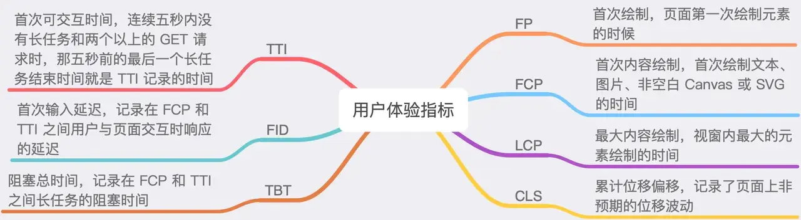

#### [window.performance.timing](https://developer.mozilla.org/zh-CN/docs/Web/API/PerformanceTiming)
+ navigationStart：同一个浏览器上一个页面卸载(unload)结束时的时间戳。如果没有上一个页面，这个值会和fetchStart相同
+ unloadEventStart: 上一个页面unload事件抛出时的时间戳。如果没有上一个页面，这个值会返回0。
+ unloadEventEnd: 和 unloadEventStart 相对应，unload事件处理完成时的时间戳。如果没有上一个页面,这个值会返回0。
+ redirectStart: 第一个HTTP重定向开始时的时间戳。如果没有重定向，或者重定向中的一个不同源，这个值会返回0
+ redirectEnd: 最后一个HTTP重定向完成时（也就是说是HTTP响应的最后一个比特直接被收到的时间）的时间戳。如果没有重定向，或者重定向中的一个不同源，这个值会返回0
+ fetchStart: 浏览器准备好使用HTTP请求来获取(fetch)文档的时间戳。这个时间点会在检查任何应用缓存之前。
+ domainLookupStart: DNS 域名查询开始的UNIX时间戳。如果使用了持续连接(persistent connection)，或者这个信息存储到了缓存或者本地资源上，这个值将和fetchStart一致。
+ domainLookupEnd: DNS 域名查询完成的时间。如果使用了本地缓存（即无 DNS 查询）或持久连接，则与 fetchStart 值相等
+ connectStart: HTTP（TCP） 域名查询结束的时间戳。如果使用了持续连接(persistent connection)，或者这个信息存储到了缓存或者本地资源上，这个值将和 fetchStart一致。
+ connectEnd: HTTP（TCP） 返回浏览器与服务器之间的连接建立时的时间戳。如果建立的是持久连接，则返回值等同于fetchStart属性的值。连接建立指的是所有握手和认证过程全部结束。
+ secureConnectionStart: HTTPS 返回浏览器与服务器开始安全链接的握手时的时间戳。如果当前网页不要求安全连接，则返回0。
+ requestStart: 返回浏览器向服务器发出HTTP请求时（或开始读取本地缓存时）的时间戳。
+ responseStart: 返回浏览器从服务器收到（或从本地缓存读取）第一个字节时的时间戳。如果传输层在开始请求之后失败并且连接被重开，该属性将会被数制成新的请求的相对应的发起时间。
+ responseEnd: 返回浏览器从服务器收到（或从本地缓存读取，或从本地资源读取）最后一个字节时。（如果在此之前HTTP连接已经关闭，则返回关闭时）的时间戳。
+ domLoading: 当前网页DOM结构开始解析时（即Document.readyState属性变为“loading”、相应的 readystatechange事件触发时）的时间戳。
+ domInteractive: 当前网页DOM结构结束解析、开始加载内嵌资源时（即Document.readyState属性变为“interactive”、相应的readystatechange事件触发时）的时间戳。
+ domContentLoadedEventStart: 当解析器发送DOMContentLoaded 事件，即所有需要被执行的脚本已经被解析时的时间戳。
+ domContentLoadedEventEnd: 当所有需要立即执行的脚本已经被执行（不论执行顺序）时的时间戳。
+ domComplete: 当前文档解析完成，即Document.readyState 变为 'complete'且相对应的readystatechange 被触发时的时间戳
+ loadEventStart: load事件被发送时的时间戳。如果这个事件还未被发送，它的值将会是0。
+ loadEventEnd: 当load事件结束，即加载事件完成时的时间戳。如果这个事件还未被发送，或者尚未完成，它的值将会是0

***通过上面的属性，可以计算得出以下值：***

+ 重定向耗时：redirectEnd - redirectStart
+ DNS查询耗时：domainLookupEnd - domainLookupStart
+ TCP链接耗时：connectEnd - connectStart
+ HTTP请求耗时：responseEnd - responseStart
+ 解析dom树耗时：domComplete - domLoading
+ 白屏时间：responseStart - navigationStart
+ DOM ready时间：domContentLoadedEventEnd - navigationStart
+ onload时间：loadEventEnd - navigationStart
>我认为白屏时间这么计算并不贴切，因为有人说：通常认为浏览器开始渲染<body>或者解析完<head>的时间是白屏结束的时间点。
----------------------
#### [页面生命周期：DOMContentLoaded，load，beforeunload](https://zh.javascript.info/onload-ondomcontentloaded)
+ DOMContentLoaded (dom解析完成的时间，包括脚本的执行完毕，因为脚本可能会修改dom结构)
>不会阻塞 DOMContentLoaded 的脚本
此规则有两个例外：
>[!CAUTION]
>具有 async 特性（attribute）的脚本不会阻塞 DOMContentLoaded，稍后 我们会讲到。
使用 document.createElement('script') 动态生成并添加到网页的脚本也不会阻塞 DOMContentLoaded。

>DOMContentLoaded 和样式
外部样式表不会影响 DOM，因此 DOMContentLoaded 不会等待它们。
>
>但这里有一个陷阱。如果在样式后面有一个脚本，那么该脚本必须等待样式表加载完成：

+ window.onload
当整个页面，包括样式、图片和其他资源被加载完成时，会触发 window 对象上的 load 事件。可以通过 onload 属性获取此事件。

+ window.onunload
当访问者离开页面时，window 对象上的 unload 事件就会被触发。我们可以在那里做一些不涉及延迟的操作，例如关闭相关的弹出窗口。

readyState
如果我们在文档加载完成之后设置 DOMContentLoaded 事件处理程序，会发生什么？

很自然地，它永远不会运行。

在某些情况下，我们不确定文档是否已经准备就绪。我们希望我们的函数在 DOM 加载完成时执行，无论现在还是以后。

+ document.readyState 属性可以为我们提供当前加载状态的信息。

它有 3 个可能值：

loading —— 文档正在被加载。
interactive —— 文档被全部读取。
complete —— 文档被全部读取，并且所有资源（例如图片等）都已加载完成。

---------------------------

#### [web性能监控](http://www.alloyteam.com/2020/01/14184/#prettyPhoto)

性能指标图：

白屏时间：从浏览器输入地址并回车后到页面开始有内容的时间；
首屏时间：从浏览器输入地址并回车后到首屏内容渲染完毕的时间；
用户可操作时间节点：domready触发节点，点击事件有反应；
总下载时间：window.onload的触发节点。

