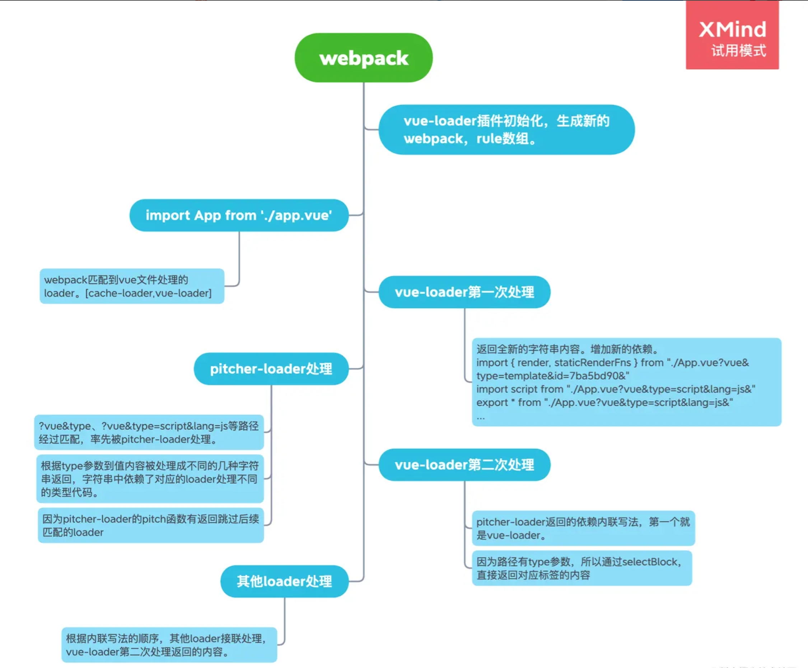

首先我们看一下vue-loader是如何翻译vue文件的，拿myIndex.vue为例：

myIndex.vue
```javascript
<template>
  <div class="wrapper"><span>45645646546546</span><p>我是谁</p></div>
</template>

<script>
export default {
  name: "",
  data() {
    return {
      message: '我是消息'
    };
  },
};
</script>
<style lang="less" scoped>
.wrapper{
  background:#000;
}
</style>
```
经过第一次vue-loader的翻译：
```javascript
import { render } from "./myIndex.vue?vue&type=template&id=753083bd&scoped=true"
import script from "./myIndex.vue?vue&type=script&lang=js"
export * from "./myIndex.vue?vue&type=script&lang=js"

import "./myIndex.vue?vue&type=style&index=0&id=753083bd&lang=less&scoped=true"

import exportComponent from "F:\\webpackLearn\\node_modules\\vue-loader\\dist\\exportHelper.js"
const __exports__ = /*#__PURE__*/exportComponent(script, [['render',render],['__scopeId',"data-v-753083bd"],['__file',"src/myIndex.vue"]])
```
经过第二次vue-loader的翻译：
```javascript

```


##### vue-loader原理流程真～～解析！看完我又学“废”了

###### vue-loader它能做什么
要说loader，那先提一下webpack，毕竟loader是webpack生态中的一环。有了loader，我们才能在基于JavaScript的程序打包整个工程，而且还能处理不是js后缀的文件，例如css、scss等。而我们学习探讨的重点vue-loader就是

+ 它可以处理我们写的VUE单文件组件。
+ template标签、style标签、script标签这些还能基于webpack的配置能被其他loader处理，也就是你vue文件里的scss还是能被post-css loader和scss loader，file-loader处理的。
+ 甚至我们可以扩展自己的模块标签。
+ 经过webpack和loader的操作，vue文件能被拆解成js和css两个部分，能被浏览器理解。

[Vue Loader 是什么？](https://vue-loader.vuejs.org/zh/#vue-loader-%E6%98%AF%E4%BB%80%E4%B9%88%EF%BC%9F)

##### 我想弄明白这几个疑惑
实话说，看了这些文档和对它表面的理解，我自己的学习思路和求知可能有以下几点

+ loader怎么解析vue文件的，它在webpack中的工作流程大概是啥？这是我最想了解的～～
+ 为什么vue-loader要配合VueLoaderPlugin插件一起使用？
+ 它怎么处理template标签内的类html语法，转化成render函数？
+ 它怎么处理css或其他扩展语言的？顺便了解一下scoped属性是怎么作用在当前组件的。
+ 最后也有一个比较大的疑问，为什么script标签和css标签内的内容，还能被别的loader处理，那些babel-loader等不是只匹配处理js文件或css文件吗？
+ 我还能做些啥？感觉挺牛b的啦，对我具体工作应该也能有些帮助吧。​
代码解析

##### 代码解析
我们先看看，使用vue-loader时，wepack配置长什么样。vue-loader必须配合VueLoaderPlugin插件使用，所以我们以这两个文件为入口，试着理解看看都做了什么。

```javascript
// webpack.config.js
const { VueLoaderPlugin } = require('vue-loader')

module.exports = {
  module: {
    rules: [
      // ... 其它规则
      {
        test: /\.vue$/,
        loader: 'vue-loader'
      }
    ]
  },
  plugins: [
    // 请确保引入这个插件！
    new VueLoaderPlugin()
  ]
}

```
规则中的test，指的是在代码中匹配到引入.vue文件的依赖时就会经过vue-loader处理。

##### 两个问题去学习解析源码

+ 直接看插件和loader入口文件做了啥。
+ 都了解做了啥后，我们分析一下一个vue文件是经过什么流程处理，变成可执行的js内容的。

直接看完下面的解析查阅文档后，其实我写的时候还是挺蒙的，所以后面一定要尝试总结的梳理流程。可以直接看看后面的流程梳理图，再回头看解析，效果会快一些。

##### VueLoaderPlugin
插件的能力就是处理一些，loader本身不负责的内容（loader应该更注重处理代码、文件内容）。比如在某个钩子周期，修改webpack配置呀，输出一些东西，启动某些服务，发送请求等等。看一下vueloader插件做了些啥。

VueLoaderPlugin入口文件：

```javascript
...
class VueLoaderPlugin {
  apply (compiler) {
    // add NS marker so that the loader can detect and report missing plugin
    if (compiler.hooks) {
      // webpack 4
      compiler.hooks.compilation.tap(id, compilation => {
        const normalModuleLoader = compilation.hooks.normalModuleLoader
        normalModuleLoader.tap(id, loaderContext => {
          // 普通模块 loader，真正（一个接一个地）加载模块图(graph)中所有模块的函数。
					// 设置标记
          loaderContext[NS] = true
        })
      })
    } else {
      // webpack < 4
      ...
    }

    // use webpack's RuleSet utility to normalize user rules
    // 获取用户webpack配置中的rules
    const rawRules = compiler.options.module.rules
    const { rules } = new RuleSet(rawRules)

    // find the rule that applies to vue files
    // 获取到vue相关配置在rules中的index
    let vueRuleIndex = rawRules.findIndex(createMatcher(`foo.vue`))
    if (vueRuleIndex < 0) {
      vueRuleIndex = rawRules.findIndex(createMatcher(`foo.vue.html`))
    }
    const vueRule = rules[vueRuleIndex]

    ...

    // get the normlized "use" for vue files
    const vueUse = vueRule.use
    // get vue-loader options
    const vueLoaderUseIndex = vueUse.findIndex(u => {
      return /^vue-loader|(\/|\\|@)vue-loader/.test(u.loader)
    })

    ...

    // make sure vue-loader options has a known ident so that we can share
    // options by reference in the template-loader by using a ref query like
    // template-loader??vue-loader-options
    const vueLoaderUse = vueUse[vueLoaderUseIndex]
    vueLoaderUse.ident = 'vue-loader-options'
    vueLoaderUse.options = vueLoaderUse.options || {}

    // for each user rule (expect the vue rule), create a cloned rule
    // that targets the corresponding language blocks in *.vue files.
    // 复制并处理那些不属于vue相关的loader
    const clonedRules = rules
      .filter(r => r !== vueRule)
      .map(cloneRule)

    // global pitcher (responsible for injecting template compiler loader & CSS
    // post loader)
    const pitcher = {
      loader: require.resolve('./loaders/pitcher'),
      resourceQuery: query => {
        const parsed = qs.parse(query.slice(1))
        return parsed.vue != null
      },
      options: {
        cacheDirectory: vueLoaderUse.options.cacheDirectory,
        cacheIdentifier: vueLoaderUse.options.cacheIdentifier
      }
    }

    // replace original rules
    // 更新webpack中rules的数组
    compiler.options.module.rules = [
      pitcher,
      ...clonedRules,
      ...rules
    ]
  }
}

function cloneRule (rule) {
  const { resource, resourceQuery } = rule
  // Assuming `test` and `resourceQuery` tests are executed in series and
  // synchronously (which is true based on RuleSet's implementation), we can
  // save the current resource being matched from `test` so that we can access
  // it in `resourceQuery`. This ensures when we use the normalized rule's
  // resource check, include/exclude are matched correctly.
  ...
	// 复制rule，并对resourceQuery进行处理，只匹配特定的参数请求路径
  return res
}

VueLoaderPlugin.NS = NS
module.exports = VueLoaderPlugin

```

其实工业级的代码中还是有很多环境判断，异常处理。我们就跳过看具体的主逻辑流程是什么就好了。

1. 在compilation钩子中处理标记，使得vue-loader知道配合使用的插件初始化了。
2. 在webpack配置中找到vue相关的loader配置，然后复制除了vue相关的loader配置外的rule。clonedRules
3. clonedRules中每个rule的resourceQuery都有特别的处理。
4. 返回新的rules = [ pitcher（一个loader）, ...clonedRules（复制的）, ...rules（原始的）]

比较陌生或无法直观理解的就是，为什么有clonedRules和pitcher。接下来看看这两个是什么情况。

##### clonedRules
复制出来的rules长什么样，又有什么作用呢？规则是为了匹配某种路径，然后执行规则内的loader，看看它复制出一堆要干啥。举个例子,下面是一个url-loader复制后的rule

作者：阿甘GK11upup
链接：https://juejin.cn/post/7013991508281917454
来源：稀土掘金
著作权归作者所有。商业转载请联系作者获得授权，非商业转载请注明出处。
```javascript
{
    "resource": {
    	"test": function
    },
    "resourceQuery":function,
    "use": [
        {
            "options": {
                "limit": 4096,
                "fallback": {
                    "loader": "/Users/.../node_modules/_file-loader@4.3.0@file-loader/dist/cjs.js",
                    "options": {
                        "name": "img/[name].[hash:8].[ext]"
                    }
                }
            },
            "ident": "ref--1-0",
            "loader": "/Users/.../node_modules/_url-loader@2.3.0@url-loader/dist/cjs.js"
        }
    ]
}


```

复制rule的目的就是增加这两个字段resource，resourceQuery（看上面代码）。其他的内容还是一样的。看看克隆方法中生成的这两函数都做了什么匹配策略。
```javascript
function cloneRule (rule) {
  const { resource, resourceQuery } = rule
  // Assuming `test` and `resourceQuery` tests are executed in series and
  // synchronously (which is true based on RuleSet's implementation), we can
  // save the current resource being matched from `test` so that we can access
  // it in `resourceQuery`. This ensures when we use the normalized rule's
  // resource check, include/exclude are matched correctly.
  let currentResource
  const res = Object.assign({}, rule, {
    resource: {
      test: resource => {
        currentResource = resource
        return true
      }
    },
    resourceQuery: query => {
      const parsed = qs.parse(query.slice(1))
      if (parsed.vue == null) {
        return false
      }
      if (resource && parsed.lang == null) {
        return false
      }
      const fakeResourcePath = `${currentResource}.${parsed.lang}`
      if (resource && !resource(fakeResourcePath)) {
        return false
      }
      if (resourceQuery && !resourceQuery(query)) {
        return false
      }
      return true
    }
  })

  if (rule.rules) {
    res.rules = rule.rules.map(cloneRule)
  }

  if (rule.oneOf) {
    res.oneOf = rule.oneOf.map(cloneRule)
  }

  return res
}

```
resource中的test过滤规则，直接返回true。其中关键的是resourceQuery，看一下官方文档的例子
>与资源查询相匹配的 Condition。此选项用于测试请求字符串的查询部分（即从问号开始）。如果你需要通过 import Foo from './foo.css?inline' 导入 Foo，则需符合以下条件：


```javascript
module.exports = {
  //...
  module: {
    rules: [
      {
        test: /\\.css$/,
        resourceQuery: /inline/,
        use: 'url-loader',
      },
    ],
  },
};


```
则我们复制后的rule的规则就是

+ 参数里开头是?vue且需要存在lang。
+ 而且如果将路径改成以lang为后缀的文件，要能进过原本的resource校验，当然参数也要经过原本的resourceQuery校验。比如app.vue?vue&lang=js，则“app.js”文件路径需要经过原本loader的resourceQuery校验。

那搞这些是为啥呢？其实就是为了之后vue中的script标签内容和css内容能经过用户配置的js和相关的css loader。剧透一下，vue-loader会将资源路径转换成类似下面的样子

```javascript
import { render, staticRenderFns } from "./App.vue?vue&type=template&id=7ba5bd90&"
import script from "./App.vue?vue&type=script&lang=js&"
export * from "./App.vue?vue&type=script&lang=js&"
import style0 from "./App.vue?vue&type=style&index=0&lang=less&"

```
这样就解决了我们的一个疑问。

###### 总结一下
通过复制rule，再重写resourceQuery，这样能够匹配一些具体引用路径的文件。比如"./App.vue?vue&type=script&lang=js&"这个内容时，webpack核心流程会根据我们编写的rule过滤出匹配到的loader数组（包含pitcher）。然后经过pitcher处理时，获取匹配到的loader数组，转换成内联写法。后面的这样我们的vue文件中的script内容才可以被设置好的jsloader处理。没理解？看下面pitcher怎么说吧～～

##### pitcher

官方解释
[Pitching Loader](https://webpack.docschina.org/api/loaders/#pitching-loader)

正常情况下，rule中匹配到，会从右向左执行loader。

```javascript
module.exports = {
  //...
  module: {
    rules: [
      {
        //...
        use: ['a-loader', 'b-loader', 'c-loader'],
      },
    ],
  },
};

```
而实际上流程是这样的
```javascript
|- a-loader `pitch`
  |- b-loader `pitch`
    |- c-loader `pitch`
      |- requested module is picked up as a dependency
    |- c-loader normal execution
  |- b-loader normal execution
|- a-loader normal execution

```
会先从左到右执行loader的pitch，如果pitch有具体的return，会中断后续的loader。比如a-loader pitch如果有返回内容，则源数据之后经过`a-loader `pitch处理，就完成了。那插件加了这个pitcher匹配了啥？做了啥？下面代码就是增加的pitch这个loader的webpack配置。

作者：阿甘GK11upup
链接：https://juejin.cn/post/7013991508281917454
来源：稀土掘金
著作权归作者所有。商业转载请联系作者获得授权，非商业转载请注明出处。
```javascript
// global pitcher (responsible for injecting template compiler loader & CSS
    // post loader)
    const pitcher = {
      loader: require.resolve('./loaders/pitcher'),
      resourceQuery: query => {
        const parsed = qs.parse(query.slice(1))
        return parsed.vue != null
      },
      options: {
        cacheDirectory: vueLoaderUse.options.cacheDirectory,
        cacheIdentifier: vueLoaderUse.options.cacheIdentifier
      }
    }

```
看了代码后，知道匹配的规则是第一个参数是?vue。处理的loader是'./loaders/pitcher'。
而pitcher.js代码的核心就是，导出一个pitch函数，而默认loader处理是直接返回代码内容。
pitcher.js入口文件：
```javascript
module.exports = code => code

// This pitching loader is responsible for intercepting all vue block requests
// and transform it into appropriate requests.
module.exports.pitch = function (remainingRequest) {
  ...
  // 当前请求资源，匹配到的所有loader
  let loaders = this.loaders
  ...
  // 遍历对应loader生成内联字符串,这里会做去重操作，因为之前plugin插件复制的rule和原始rule都会匹配到，所以为了避免一个请求路径被同一个loader处理两次，需要去重
  const genRequest = loaders => {
  	...
  }
  // Inject style-post-loader before css-loader for scoped CSS and trimming
  if (query.type === `style`) {
  	...
    return ...
  }
  // for templates: inject the template compiler & optional cache
  if (query.type === `template`) {
    ...
    return ...
  }
  ...
  // When the user defines a rule that has only resourceQuery but no test,
  // both that rule and the cloned rule will match, resulting in duplicated
  // loaders. Therefore it is necessary to perform a dedupe here.
  const request = genRequest(loaders)
  const scode = `import mod from ${request}; export default mod; export * from ${request}`
  return scode
}

```
整个pitch方法，逻辑也比较清晰，经过规则匹配的文件路径会经过此loader的pitch处理，而这个pitch是有返回值的，所以它的返回内容不会再经过其他loader。
它针对几种情况，有不同的返回。

###### 情况一：如果路径是?vue&type=style
```javascript
if (query.type === `style`) {
    const cssLoaderIndex = loaders.findIndex(isCSSLoader)
    if (cssLoaderIndex > -1) {
      const afterLoaders = loaders.slice(0, cssLoaderIndex + 1)
      const beforeLoaders = loaders.slice(cssLoaderIndex + 1)
      // genRequest根据webpack匹配到的几个loader，转换成内联写法的字符串
      const request = genRequest([
        ...afterLoaders,
        stylePostLoaderPath,
        ...beforeLoaders
      ])
      return query.module
        ? `export { default } from  ${request}; export * from ${request}`
        : `export * from ${request}`
    }
  }

```
上面代码中的loaders，是当前引用的文件路径匹配到的所有loader。
整个逻辑块做的是将匹配到的loader转成内联写法的字符串。然后返回一个默认导出的字符串。比如 import a from ''../a.vue?vue&type=style,经过这个loader的pitch函数作用后。我import的文件内容变成了export * from ${request}，而request就是匹配a.vue?vue&type=style这个路径规则的loader的内联写法。这里直接输出一下，当前匹配到啥loader。假设，vue-loader转换了一波路径变成下面这样。（看到后面会知道为什么会变成 import a from './App.vue' 会变成下面这样）import style from "/Users/.../src/components/Detail.vue?vue&type=style&index=0&id=a38ba3fe&scoped=true&lang=less&"这路径经过webpack处理会匹配到啥？看下面，太清楚明白了。


```javascript
path: '/Users/.../src/components/Detail.vue?vue&type=style&index=0&id=a38ba3fe&scoped=true&lang=less&',
  loaders: [
    {
      path: '/Users/.../node_modules/_vue-style-loader@4.1.3@vue-style-loader/index.js',
      ...
    },
    {
      path: '/Users/.../node_modules/_css-loader@3.6.0@css-loader/dist/cjs.js',
      ...
    },
    {
      path: '/Users/.../node_modules/_postcss-loader@3.0.0@postcss-loader/src/index.js',
			...
    },
    {
      path: '/Users/.../node_modules/_less-loader@5.0.0@less-loader/dist/cjs.js',
      ...
    },
    {
      path: '/Users/.../node_modules/_vue-loader@15.9.7@vue-loader/lib/index.js',
      ...
    }
  ]

```
源代码的注释也很明白了（// Inject style-post-loader before css-loader for scoped CSS and trimming），找到css-loader，在它之前插入style-post-loader，目的就是为了做scoped和修剪。然后将处理好的loader数组通过一个genRequest函数，返回一个字符串路径。后面我们再看看具体变成什么样。
先了解一下stylePostLoaderPath这个loader。
```javascript
...
// stylePostLoaderPath
module.exports = function (source, inMap) {
  const query = qs.parse(this.resourceQuery.slice(1))
  const { code, map, errors } = compileStyle({
    source,
    filename: this.resourcePath,
    id: `data-v-${query.id}`,
    map: inMap,
    scoped: !!query.scoped,
    trim: true
  })

  if (errors.length) {
    this.callback(errors[0])
  } else {
    this.callback(null, code, map)
  }
}

```
而stylePostLoaderPath做的就是根据路径参数scoped是否为true，如果是id值就做为scopedid，重新修改style样式，给每个选择器加上属性选择器。例如
```javascript
.p-class{
	font-size:20px
}
==>>
.p-class[data-v-xxxxxx]{
	font-size:20px
}

```

这样再配合vue-loader最中导出component组件中配置的hasScoped，使用同样的id，在运行时阶段就会通过将vnode创建成真实dom时拼接上dom的属性中。

###### 情况二：如果路径是?vue&type=template
看看会匹配到什么loader，一般情况下只有一个vue-loader。
```javascript
loaders: [
    {
      path: '/Users/***/node_modules/_vue-loader@15.9.7@vue-loader/lib/index.js',
      query: '??vue-loader-options',
			...
    }
  ]

```
再看看源码是怎么处理template相关的loader数组。最关键是👇下面的templateLoaderPath这个loader，它的作用就是生成我们熟悉的render函数。
```javascript
// for templates: inject the template compiler & optional cache
  if (query.type === `template`) {
    const path = require('path')
    const cacheLoader = cacheDirectory && cacheIdentifier
      ? [`${require.resolve('cache-loader')}?${JSON.stringify({
        // For some reason, webpack fails to generate consistent hash if we
        // use absolute paths here, even though the path is only used in a
        // comment. For now we have to ensure cacheDirectory is a relative path.
        cacheDirectory: (path.isAbsolute(cacheDirectory)
          ? path.relative(process.cwd(), cacheDirectory)
          : cacheDirectory).replace(/\\/g, '/'),
        cacheIdentifier: hash(cacheIdentifier) + '-vue-loader-template'
      })}`]
      : []
    const preLoaders = loaders.filter(isPreLoader)
    const postLoaders = loaders.filter(isPostLoader)

    const request = genRequest([
      ...cacheLoader,
      ...postLoaders,
      templateLoaderPath + `??vue-loader-options`,
      ...preLoaders
    ])
    // the template compiler uses esm exports
    return `export * from ${request}`
  }

```
templateLoaderPath这个loader它是怎么生成render函数的呢？里面引用了一个关键的vue-template-compiler包，这里不对源码展开，直接看它能产出什么，看一下官方解释。


compiler.compile(template, [options])

```javascript
{
  ast: ?ASTElement, // parsed template elements to AST 模板ast
  render: string, // main render function code render函数
  staticRenderFns: Array<string>, // render code for static sub trees, if any 静态子树
  errors: Array<string> // template syntax errors, if any 异常
}

```

而这个vue-template-compiler来源也不完全是引入npm包，在整个vue-loader中的是可以通过配置传递进来的。这就给了我们很大的可能，让我们能在编译阶段获得ast，render函数。甚至改变它
```javascript
const compiler = options.compiler || require('vue-template-compiler')

```

###### 情况三：如果路径是?vue&type=js

在源码中，特殊处理了type=style和type=template的情况，而js则是默认处理的情况。
看看默认下匹配到了啥loader
```javascript
loaders: [
    {
      path: '/Users/.../node_modules/_cache-loader@4.1.0@cache-loader/dist/cjs.js',
      ...
    },
    {
      path: '/Users/.../node_modules/_babel-loader@8.2.2@babel-loader/lib/index.js',
      ...
    },
    {
      path: '/Users/.../node_modules/_vue-loader@15.9.7@vue-loader/lib/index.js',
      ...
    }
  ]

```
返回处理，然后我们再看看返回了啥，request是什么。
```javascript
// When the user defines a rule that has only resourceQuery but no test,
  // both that rule and the cloned rule will match, resulting in duplicated
  // loaders. Therefore it is necessary to perform a dedupe here.
  const request = genRequest(loaders)
  const scode = `import mod from ${request}; export default mod; export * from ${request}`
  return scode

```
```javascript
request:"-!../node_modules/_cache-loader@4.1.0@cache-loader/dist/cjs.js??ref--12-0!../node_modules/_babel-loader@8.2.2@babel-loader/lib/index.js!../node_modules/_vue-loader@15.9.7@vue-loader/lib/index.js??vue-loader-options!./App.vue?vue&type=script&lang=js&"

```
##### 总结一下pitcher

+ 根据之前插件复制出来的rules，在匹配路径?vue&type=xx时，进入这个pitcher-loader
+ 此loader有pitch函数返回，所以不会将结果交给其他匹配到的loader继续处理
+ 根据三种type，处理返回不同的内容。也不是直接处理代码内容，而是生成新的引用写法，串联不同loader。（注意内联的第一个处理loader是vue-loader）
+ 之后会进入新的webpack匹配中，这之后才是真正意义上的处理我们的vue源码文件


##### vue-loader（入口文件）
简化版本，先看一遍代码和注释。
```javascript
const { parse } = require('@vue/component-compiler-utils')
...
module.exports = function (source) {
  const loaderContext = this
	// 配套plugin插件如果没配置会报错
  if (!errorEmitted && !loaderContext['thread-loader'] && !loaderContext[NS]) {
  }
	...
  // 根据上下文获取当前匹配到资源的相关信息
  const {
    target,
    request,
    minimize,
    sourceMap,
    rootContext,
    resourcePath,
    resourceQuery = ''
  } = loaderContext
  
    // 根据上下文和插件配置提取信息
  ...
  
  // source和解析配置经过@vue/component-compiler-utils处理，返回描述内容
  const descriptor = parse({
    source,
    compiler: options.compiler || loadTemplateCompiler(loaderContext),
    filename,
    sourceRoot,
    needMap: sourceMap
  })

  // if the query has a type field, this is a language block request
  // e.g. foo.vue?type=template&id=xxxxx
  // and we will return early
  // 如果依赖路径存在type参数，直接经过selectBlock处理返回
  if (incomingQuery.type) {
    return selectBlock(
      descriptor,
      loaderContext,
      incomingQuery,
      !!options.appendExtension
    )
  }

  // module id for scoped CSS & hot-reload
  // scoped和热更新逻辑
  ...
  const id = hash(
    isProduction
      ? (shortFilePath + '\n' + source.replace(/\r\n/g, '\n'))
      : shortFilePath
  )

  // feature information
  const hasScoped = descriptor.styles.some(s => s.scoped)
  ...

  // template
  let templateImport = `var render, staticRenderFns`
  let templateRequest
  if (descriptor.template) {
    ...
    // 处理template
  }
  // script
  let scriptImport = `var script = {}`
  if (descriptor.script) {
    ...
    // 处理script
  }
  // styles
  let stylesCode = ``
  if (descriptor.styles.length) {
    ...
    处理styles
  }

  let code = `
${templateImport}
${scriptImport}
${stylesCode}

/* normalize component */
import normalizer from ${stringifyRequest(`!${componentNormalizerPath}`)}
var component = normalizer(
  script,
  render,
  staticRenderFns,
  ${hasFunctional ? `true` : `false`},
  ${/injectStyles/.test(stylesCode) ? `injectStyles` : `null`},
  ${hasScoped ? JSON.stringify(id) : `null`},
  ${isServer ? JSON.stringify(hash(request)) : `null`}
  ${isShadow ? `,true` : ``}
)
  `.trim() + `\n`
  ...
  // 热更新相关内容
  if (needsHotReload) {
    code += `\n` + genHotReloadCode(id, hasFunctional, templateRequest)
  }

  ...

  code += `\nexport default component.exports`
  // 返回处理后的code
  return code
}

module.exports.VueLoaderPlugin = plugin


```

看完入口文件，大概有几点关键内容。

+ webpack在经过loader处理时，传入的上下文，会包含资源的一些信息。
+ @vue/component-compiler-utils的parse处理后返回的表述内容都会是啥？
+ 存在一个incomingQuery.type判断，会return处理结果（也是关键的一步，先留意一下）
+ 生成了css的scopedid
+ 处理了文件内的三块标签，处理了啥？
+ 返回处理完的字符串code

一个个看看这里的关键信息都做了啥

##### loaderContext
进入源码，打印出来看看

```javascript
{
  target: 'web', // 打包目标环境
  request: '/Users/.../node_modules/_vue-loader@15.9.7@vue-loader/lib/index.js??vue-loader-options!/Users/.../node_modules/_eslint-loader@2.2.1@eslint-loader/index.js??ref--13-0!/Users/.../src/App.vue', // 当前依赖匹配loader的内联方式表示
  minimize: undefined,
  sourceMap: true,
  rootContext: '/Users/...', // 当前vue项目根目录
  resourcePath: '/Users/.../src/App.vue', // 引入依赖绝对路径
  resourceQuery: '' // 依赖路径上的参数
}

```
这些基础信息也很关键，特别是resourceQuery，这里的参数将作为后续逻辑处理的重要判断。

##### @vue/component-compiler-utils的parse处理
@vue/component-compiler-utils这个用来编译vue文件的底层工具，具体的转换逻辑就是在这里进行。里面做了source map的映射处理。css scoped的处理。还有最重要的template标签内容处理。核心能力利用vue-template-compiler包将 template => ast => render函数,有了文件内容的ast描述，才能生成对应的render函数，提供给vue运行时渲染视图。而ast描述也给我们增加了更多可能，能够在边缘阶段知道文件都编写了什么内容。但是这里处理tempalte生成渲染函数并不是在这段代码中运行的，这里只是接收options中的配置内容。我们再看看vue-template-compiler的相关配置和能力
先看看处理前接收什么参数

```javascript
const { parse } = require('@vue/component-compiler-utils')
...
const descriptor = parse({
    source, // 文件内容
    compiler: options.compiler || loadTemplateCompiler(loaderContext), // compiler配置，这里的options.compiler就是vue-template-compiler
    filename, // 文件名称 'App.vue'
    sourceRoot, // 文件目录 'src'
    needMap: sourceMap
})

```
看看输出结果是啥
```javascript
descriptor: {
    template: {
      type: 'template',
      content: '\n' +
        '<div id="app">\n' +
					...
        '</div>\n',
      start: 10,
      attrs: {},
      end: 569
    },
    script: {
      type: 'script',
      content: '//\n' +
					...
        '}\n',
      start: 590,
      attrs: {},
      end: 2251,
      map: [Object]
    },
    styles: [ {
    	type: 'styles',
      content: '//\n' +
					...
        '}\n',
      start: 2280,
      attrs: {lang: 'less' },
      lang: 'less',
      end: 3133,
      map: [Object]
    } ],
    customBlocks: [],
    errors: []
  }

```

输出了每个标签模块的源内容。但是这里的输出只是基本的解析，其实解析成render函数的地方不是这。而是之前看的pitch-loader中pitcher阶段里转变成内联loader时增加的templateLoader

###### incomingQuery.type
这个是啥？看下面的源码，至少vue-loader处理的结果有两种情况的返回。这是很关键的点哦

```javascript
const {
    target,
    request,
    minimize,
    sourceMap,
    rootContext,
    resourcePath,
    resourceQuery = ''
  } = loaderContext
  const rawQuery = resourceQuery.slice(1)
  const inheritQuery = `&${rawQuery}`
  const incomingQuery = qs.parse(rawQuery)
 	...
  if (incomingQuery.type) {
    console.log({
      path:this.resourcePath,
      resourceQuery: this.resourceQuery,
      incomingQuery,
      path: '~~~~~~~~~~'
    })
    return selectBlock(
      descriptor,
      loaderContext,
      incomingQuery,
      !!options.appendExtension
    )
  }
	...
  // code 处理组合...
  ...
  return code

```
我们可以打断点，或console输出看看这里都是啥。这里输出的是当前处理的引用资源路径。
```javascript
{
  path: '/Users/.../src/App.vue',
  resourceQuery: '?vue&type=template&id=7ba5bd90&',
  incomingQuery: [Object: null prototype] {
    vue: '',
    type: 'template',
    id: '7ba5bd90'
  },
  path: '~~~~~~~~~~'
}

```
可以看出，引用路径大概是/Users/.../src/App.vue?vue&type=template&id=7ba5bd90&，而如果存在参数type就会进入这种返回。通过selectBlock函数返回处理结果。其实这里就是依据之前的descriptor结果，获得解析分割好的template、script、style部分的源代码。

###### vue文件主要部分（template、script、style）
直接看看简单点看看，import App form './App.vue',处理成了啥吧之前的源码返回的部分，前几行代码是👇，我们直接输出结果，再分析，这三个变量是怎么转换的。

```javascript
${templateImport}
${scriptImport}
${stylesCode}

```
处理结果如下，先重点看前几行。其实就是将vue组件内的三大部分引入进来，引入路径不光光是.vue还要增加相应的type参数和lang参数。新的引入路径交给别的loader处理，就能拿到指定的返回内容。然后将这些内容交给runtime的componentNormalizer处理，就是我们组件的完整内容，包含各类配置和render函数。

```javascript
import { render, staticRenderFns } from "./App.vue?vue&type=template&id=7ba5bd90&"
import script from "./App.vue?vue&type=script&lang=js&"
export * from "./App.vue?vue&type=script&lang=js&"
import style0 from "./App.vue?vue&type=style&index=0&lang=less&"


/* normalize component */
import normalizer from "!../node_modules/_vue-loader@15.9.7@vue-loader/lib/runtime/componentNormalizer.js"
var component = normalizer(
  script,
  render,
  staticRenderFns,
  false,
  null,
  null,
  null
  
)

/* hot reload */
if (module.hot) {
  var api = require("/Users/gankai/k-file/myProject/科技防疫/prevention2/node_modules/_vue-hot-reload-api@2.3.4@vue-hot-reload-api/dist/index.js")
  api.install(require('vue'))
  if (api.compatible) {
    module.hot.accept()
    if (!api.isRecorded('7ba5bd90')) {
      api.createRecord('7ba5bd90', component.options)
    } else {
      api.reload('7ba5bd90', component.options)
    }
    module.hot.accept("./App.vue?vue&type=template&id=7ba5bd90&", function () {
      api.rerender('7ba5bd90', {
        render: render,
        staticRenderFns: staticRenderFns
      })
    })
  }
}
component.options.__file = "src/App.vue"
export default component.exports

```
#### 总结
这里我们vue-loader做的主要的逻辑都理清楚了，但是对于全局我们还没串联起来，先不急，先总结一下vue-loader能做啥事。

1. webpack在经过loader处理时，传入的上下文，会输出包含引用资源的一些信息，路径参数等等
2. parse处理，会返回vue源文件的每个部分的代码内容。
3. vue-loader有两种返回方式，如果路径存在type参数。直接通过selectBlock返回结果。另一种情况，没有直接返回vue文件源代码内容。而是生成新的引用路径然后再拼接一些字符串内容返回，这些新内容的引用路径将会再次通过webpack解析



差不多完了，整体都比较清晰了。看看开头我自己的几个疑惑有没有解决。

1. loader怎么解析vue文件的，它在webpack中的工作流程大概是啥？这是我最想了解的～～上图👆
2. 为什么vue-loader要配合VueLoaderPlugin插件一起使用？插件打杂，要复制新的rule。
3. 它怎么处理template标签内的类html语法，转化成render函数？可以再看一下pitcher对template的处理，pitcher阶段里转变成内联写法loader时增加的**templateLoader**
4. 它怎么处理css或其他扩展语言的？顺便了解一下scoped属性是怎么作用在当前组件的。vue-loader第一次处理，增加scopedid，pitcher处理后，依次处理css文件，其中stylePostLoader根据参数处理css代码，增加属性选择器。
5. 最后也有一个比较大的疑问，为什么script标签和css标签内的内容，还能被别的loader处理，那些babel-loader等不是只匹配处理js文件或css文件吗？插件复制出来的loader处理的，带lang属性的就能匹配到对应的loader，然后pitcher改写成内联写法，逐一处理。
6. 我还能做些啥？感觉挺牛b的啦，对我具体工作应该也能有些帮助吧。在工作中，我们可能较少的业务会直接改动到vue-loader的代码，但是知道整个流程后。如果需要拓展改造，这就没什么难度了。如果项目中需要我们主动解析本地代码，去做一些构建时的处理，同步配置、特殊构建等。我们就有了入手点，vue-loader中的vue-template-compiler配置就是一个点，它能解析template内容，生成ast和render函数，这里我们就有机会对项目进行特殊的处理。


##### 其他
在我反复研究流程后，还是发现不少疑惑，一下没太明白的问题。

1. 为什么还要pitcher？vue-loader直接处理内联写法不行吗？
2. 插件复制rule做什么？我已经知道需要复制的rule能处理什么文件类型，直接转？

自己也没太明白，后面给了自己几个相对合理的解释，不知道是否如此。

1. 尝试过直接在vue-loader第一次处理时，返回pitcher处理后的内容。发现流程也是可行的。但是这是我知道在pitcher处理后，具体的需要的loader是哪些的前提下可以直接返回。如果我们直接便利rule，去检索相关的匹配条件，直接拼接内联的loader写法，是可以实现的。但vue没那么做，我感觉是因为这些匹配规则和写法其实是webpack主导配置的，它有自己的匹配逻辑，所以应该是遵循webpack的rule写法，然后在this.loader下自然能获取到匹配到的loader。这样才是符合逻辑和标准的，如果自己写匹配逻辑，可能会因为webpack的升级和写法的改变而出错。这就导致vue-loader的第一次处理不能直接转换内联写法（毕竟第一次处理匹配的是.vue后缀的文件）。那么我们就需要一个loader，在.vue文件的loader处理后，是能第一个接触到处理结果的loader，再根据上下文的loader数组进行内联处理，处理结果还不想被其他loader改变，只能有pitch函数承担这个责任。
2. 所以，在第一点的背景下，是有必要遵循webpack的rule匹配逻辑。当我们想匹配带参数的路径，就需要编写相应的rule规则。所以自然就需要新的rule。这样后续的pitcher才能在webpack构建的流程中获得loader数组。

答: [vue-loader.vuejs.org](https://vue-loader.vuejs.org/zh/migrating.html)里 有提到，v14是自己推导的rule，v15 把type=xxx中xxx当做一个真正的xxx文件，比如less，这样vue里的less和其他less文件就可以使用同样的 rule option，在14里，如果对vue的block有其他配置，还得在 vue-loader的 option 里重新写一遍。。比较麻烦，所以直接复制出来就好啦

