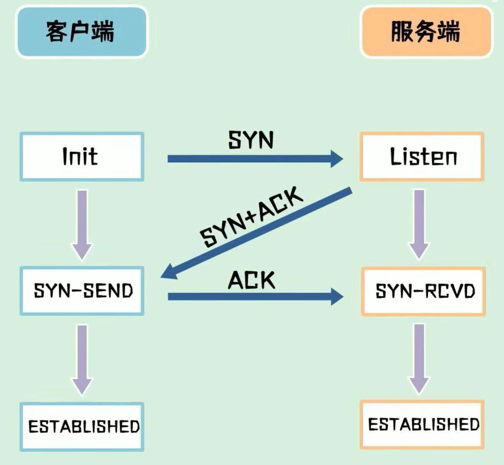
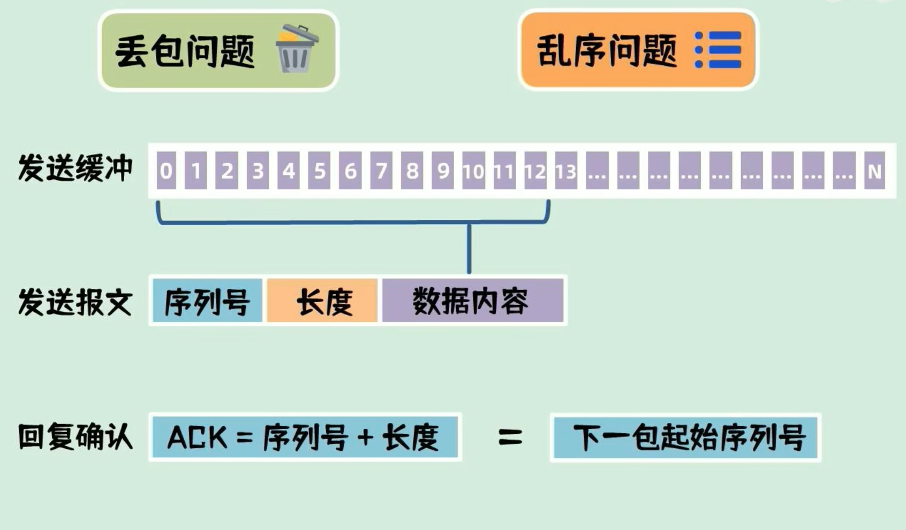
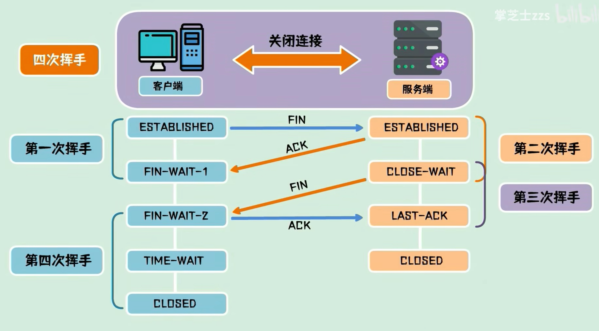
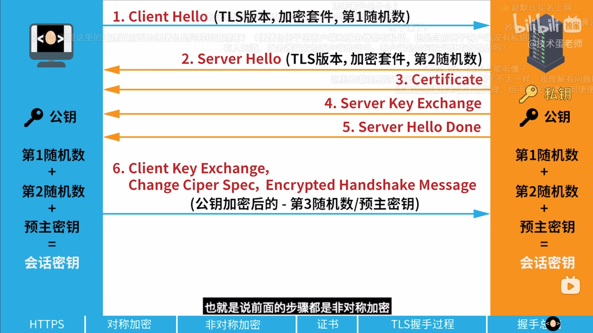

### TCP、UDP、HTTP

##### HTTP（超文本传输协议）
+ 层次：应用层协议
+ 功能：HTTP用于在Web浏览器和服务器之间传输超文本数据（如HTML文件）。它定义了数据的格式和传输方式。
+ 特性：HTTP是一个无状态的请求/响应协议，每次请求都是独立的。

##### TCP（传输控制协议）
+ 层次：传输层协议
+ 功能：TCP提供可靠的、面向连接的通信。它确保数据包按顺序到达，并且没有丢失或重复。
+ 特性：TCP提供错误检测、流量控制和拥塞控制机制。它建立连接（三次握手）和断开连接（四次挥手）。

##### UDP（用户数据报协议）
+ 层次：传输层协议
+ 功能：UDP提供无连接的、不可靠的数据传输。适用于需要快速传输、对丢包不敏感的应用。
+ 特性：UDP没有建立连接的过程，也没有保证数据包顺序和完整性的机制。它的开销比TCP低，适用于实时应用（如视频流、游戏等）。
#####  关系和工作流程
1. 层次关系：HTTP位于应用层，TCP和UDP位于传输层。TCP和UDP是并列关系，但它们可以分别为应用层协议（如HTTP、DNS、DHCP等）提供服务。

2. HTTP和TCP的关系：HTTP通常使用TCP作为传输协议，因为HTTP需要可靠的数据传输。HTTP请求和响应的数据通过TCP连接传输，这保证了数据的完整性和顺序。
    + 工作流程：客户端发起HTTP请求 -> HTTP数据打包在TCP段中 -> TCP通过IP层传输数据 -> 服务器接收并解包TCP段中的HTTP数据 -> 服务器处理请求并返回响应。
3. UDP的使用场景：HTTP通常不使用UDP，因为UDP不保证数据传输的可靠性。然而，有些应用层协议（如DNS、VoIP、视频流等）使用UDP，因为它们需要低延迟和快速传输，即使这意味着可能会有数据包丢失。

##### 总结：

+ HTTP依赖于TCP来提供可靠的数据传输。
+ TCP和UDP是两种不同的传输层协议，各有适用场景。
+ HTTP作为一种应用层协议，通常使用TCP，而不是UDP。
>TCP和UDP都工作在传输层，目标都是在程序之间传递数据（文本、视频、图片）。对于两种协议都是二进制数据，并无区别

+ UDP：类似写信（对方是否能收到、收到的信是否完整、多封信顺序是否正确），数据包之间没有状态联系
+ TCP：类似于打电话，先建立连接，在传输数据
tcp通过三次握手、传输确认、四次挥手来保证传输的稳定性

##### TCP
###### 三次握手建立连接

>1.为什么需要三次握手而不是两次呢？
&emsp; 防止已失效的报文SYN又传输到服务器，导致服务端认为客户端又发起了一个新的连接。
2.如何保证数据的完整性和顺序?
&emsp; 服务端发送数据：通过分割报文，并给报文添加索引和长度
&emsp; 客户端收到数据：ACK = 索引 + 长度，将ACK返回服务端，这就是下一包数据的序列号

###### 四次挥手：

>为什么需要超时等待?
&emsp; 服务端没收到ack包，会一直处于等待关闭状态。为了解决这个问题，服务端未收到ack时，会重新发送fin包，客户端收到fin包重新发送ack并重置超时等待时间

---

### HTTPS

###### https是什么?
###### 加密原理和证书?
###### SSL/TSL握手过程?

<!-- 首先还是http一样的三次握手，建立tcp连接：
三次握手成功以后，
客户端想服务器发起一个请求，告诉服务端支持的TLS版本和支持的加密套件（也就是不同的加密算法），并生成一个随机数给服务端

服务器响应：在响应报文中告诉客户端自身支持的TLS版本和加密套件，并且也生成一个随机数给客户端

服务器再发一个响应把自己的证书给客户端，以便于客户端在整数的信任列表确认当前服务器是否可信，
把公钥发送给客户端
发请求告诉客户端我的响应结束了

客户端生成第三个随机数（预主密钥），用服务端的公钥加密预主密钥并发送给服务端

客户端：tsl协商结束

服务端：tsl协商结束 -->

> 三次握手结束后，通过非对称加密计算会话密钥，通过对称加密进行数据传输
##### 非对称加密：
1.客户端发起请求：
  + 支持的TSL协议版本
  + 支持的加密套件（加密算法）
  + 生成一个随机数

2.服务端：
 + 确认支持的TLS版本
 + 确认支持的加密套件
 + 生成一个随机数给客户端
 + 证书
 + 公钥

3.客户端：
 + 生成第三个随机数（预主密钥）
 + 用服务端公钥加密预主密钥并发送给服务端

4.服务端：
 + 私钥解密加密后的预主密钥，得到预主密钥
##### 对称加密(会话密钥)：
客户端和服务端分别计算，但结果相同
会话密钥 = 第一随机数+第二随机数+预主密钥

###### 为什么不是两次握手？
客户端发起唯一的syn，即便发送了多次，服务端收到其中一个syn并恢复ack即便发送ack，但是syn和ack都是重复的，并不会出现重复链接问题
主要原因：
1. 确认客户端接收能力：
如果是两次握手，服务端发出ack，并不确定客户端是否收到了ack就开始发送数据，会丢包
在三次握手中，第三次握手（客户端发送 ACK）确保了客户端确实收到了服务器的 SYN-ACK 包。这一步确认了客户端的接收能力。
如果使用两次握手，服务器发送 SYN-ACK 后没有得到客户端的确认，服务器无法知道客户端是否已经准备好接收数据。

2. 防止历史连接干扰：
在实际网络中，可能会有延迟或丢失的包。例如，一个旧的 SYN 包在网络中延迟到达服务器，如果服务器根据这个旧的 SYN 包建立连接，可能会导致误操作。
三次握手可以确保这种旧连接请求不会干扰新的连接请求。客户端发送的第三个 ACK 包可以确认连接是基于最新的 SYN 包，而不是某个延迟到达的旧 SYN 包。

3. 序列号的同步：
双方需要同步各自的初始序列号，以确保后续数据传输的有序性和完整性。
三次握手确保了双方正确地交换和确认了对方的初始序列号。

##### 具体案例分析：
###### 情景：旧的 SYN 包干扰
+ 假设客户端发送了一个 SYN 包，请求建立连接，但该 SYN 包由于网络问题延迟到达服务器。
+ 客户端在超时后重发了一个新的 SYN 包，服务器收到了这个新的 SYN 包并建立了连接。
+ 一段时间后，旧的 SYN 包到达服务器，如果使用两次握手，服务器会认为这是一个新的连接请求，并发送 SYN-ACK 包。客户端收到这个 SYN-ACK 包后会认为这是一个新的连接，从而导致重复连接。

三次握手中的第三次 ACK 确保了客户端确认了服务器的 SYN-ACK 包，这样服务器可以确认连接请求是基于最新的 SYN 包，而不是旧的 SYN 包。
