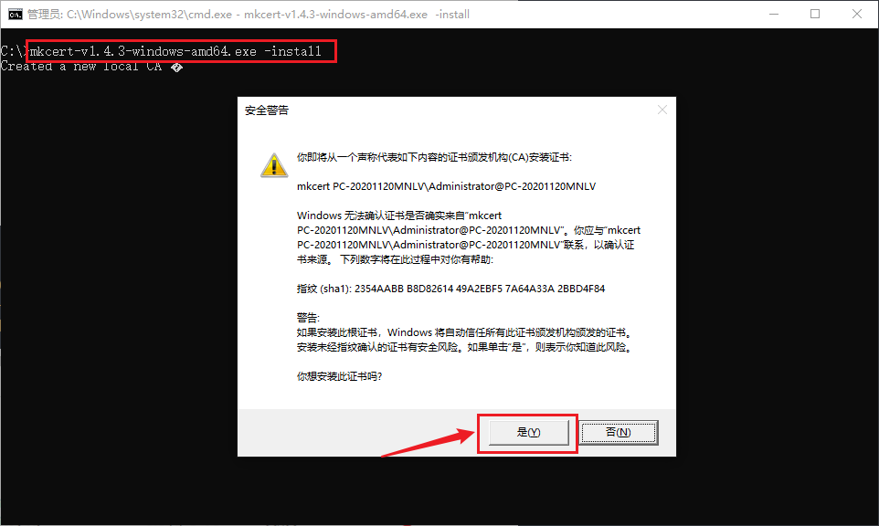
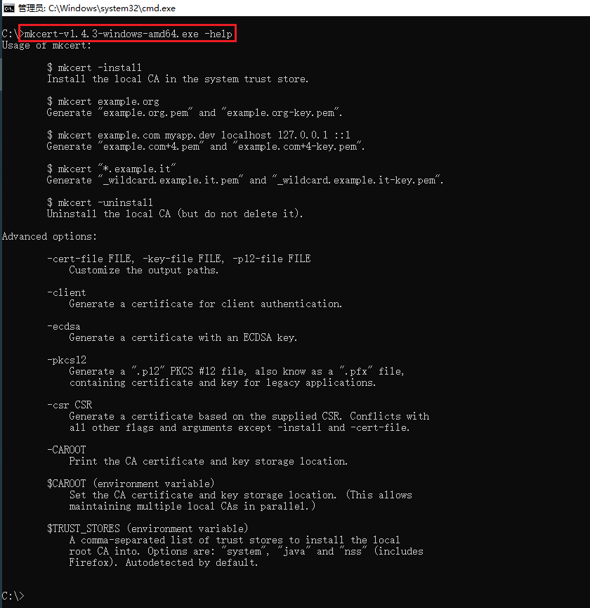
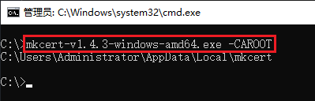
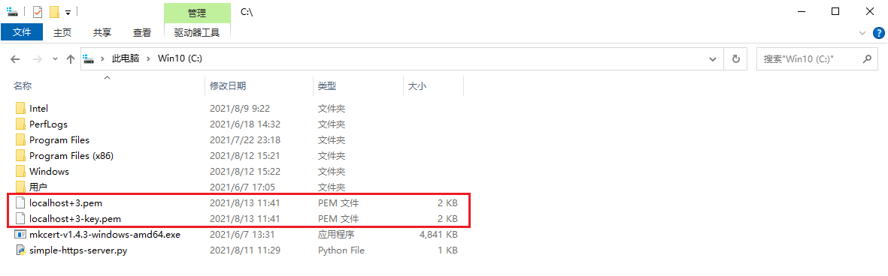
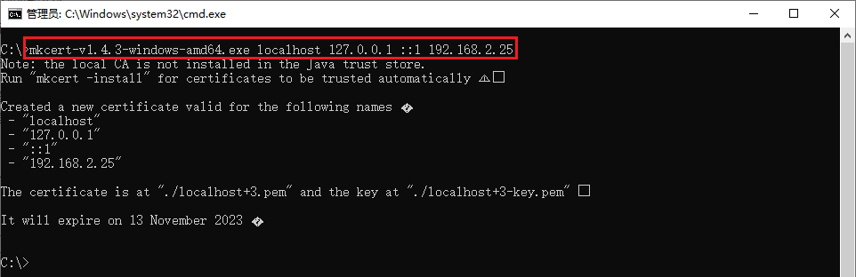
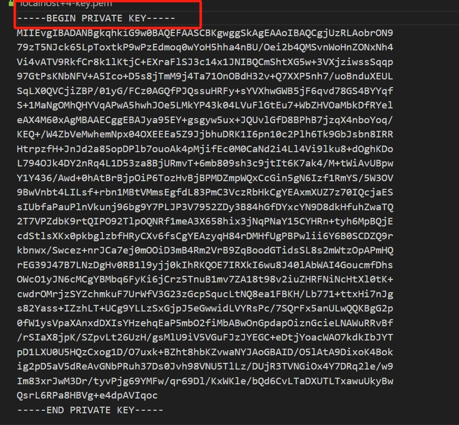
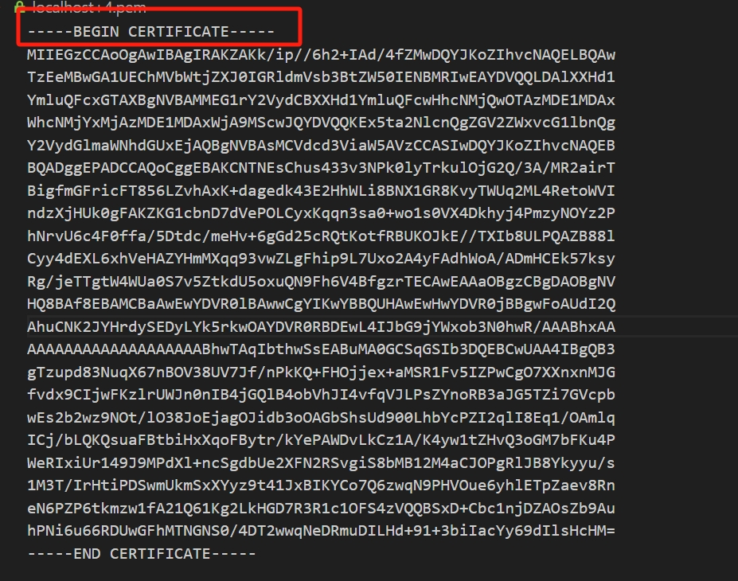
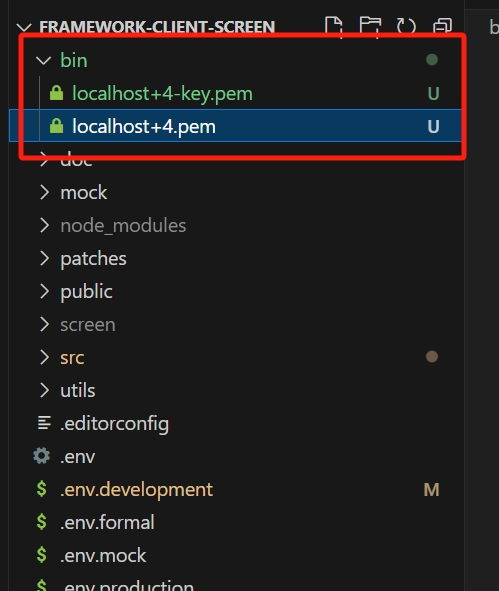

#### vite本地开发中配置https步骤：

###### 一、安装和生成证书

1. [mkcert程序(mkcert-v1.4.4-windows-amd64.exe)](https://github.com/FiloSottile/mkcert/releases/tag/v1.4.4)


2. 安装程序

    打开cmd窗口执行：```mkcert-v1.4.4-windows-amd64.exe -install```

    

3. 测试是否安装成功

    ```mkcert-v1.4.4-windows-amd64.exe --help```

    

4. 查看根证书存在位置

    ```mkcert-v1.4.4-windows-amd64.exe -CAROOT```

    

5. 生成自签证书,可供局域网内使用其他主机访问
    直接跟多个要签发的域名或 ip 就行了，比如签发一个仅本机访问的证书(可以通过127.0.0.1和localhost，以及 ipv6 地址::1访问)
    ~请求地址的ip是多少，要配在这里~

    ```mkcert-v1.4.4-windows-amd64.exe localhost 127.0.0.1 ::1 192.168.2.25 172.16.0.110```

    

    
    生成的证书在mkcert-v1.4.4-windows-amd64.exe同级目录下，点击可以查看文件内容，带有key字样的是key，cer字样的是证书，下面会用到

key：


证书：


###### 二、使用证书
1. 将证书复制到项目根目录的bin文件夹下


2. vite.config.js配置证书
    ```javascript
    // 引入证书
    import path from 'path'
    import fs from 'fs'
    // 加载证书和私钥文件
    const privateKey = fs.readFileSync(path.resolve(__dirname, './bin/localhost+4-key.pem'), 'utf8');
    const certificate = fs.readFileSync(path.resolve(__dirname, './bin/localhost+4.pem'), 'utf8');

    // 在config的server中配置证书
    server: {
        host: '0.0.0.0',
        proxy: viteProxy(env),
        https: {
        key: privateKey,
        cert: certificate,
        // 忽略 SSL 证书错误
        rejectUnauthorized: false,
        }
    }
    ```
3. 在代理中添加seccure: false
    ```javascript
    '/mapSate': {
        target: 'https://172.16.0.110',
        ws: false,
        changeOrigin: true,
        secure: false,
    }
    ```