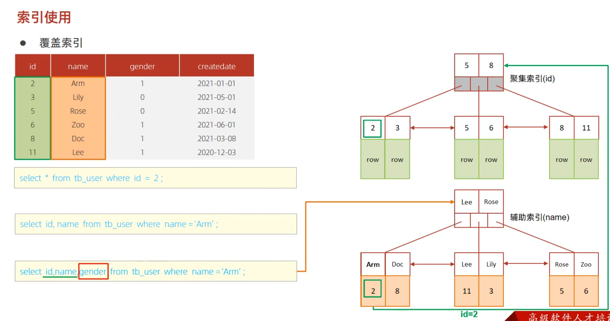
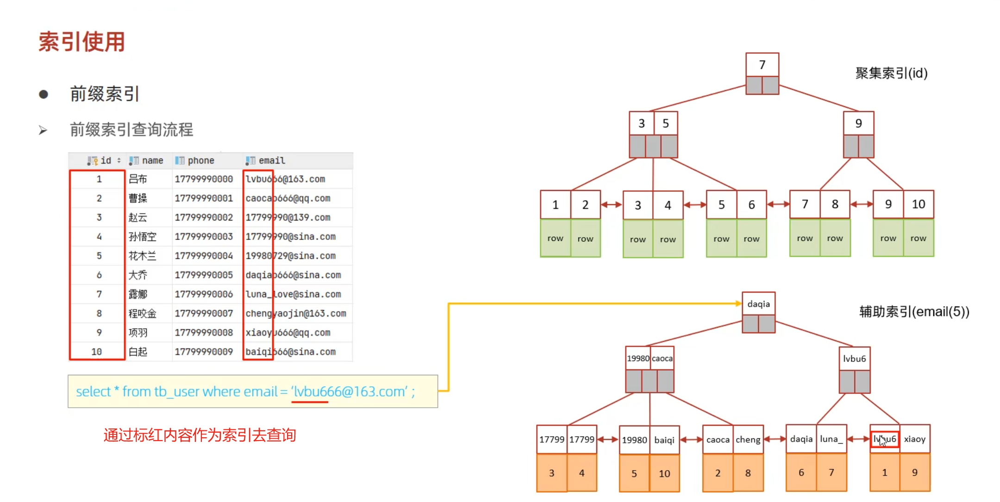

>前缀索引和辅助索引存储的是索引和对应列以及聚集索引的关系，只有聚集索引存储了完整行的数据，辅助索引和前缀索引都是为了找到聚集索引，如果查找的字段仅包含聚集索引字段和辅助索引的字段，那么就是索引覆盖，不需要回表查询,如果select的字段不在辅助和前缀索引，也不是聚集索引对印的列，那么就要去聚集索引对应的行中再次查询需要的数据。Extra=NUll 就是回表查询

##### 辅助索引
辅助索引（name 列）用于加速查询 name = 'Arm' 的数据。通过辅助索引可以找到 name 为 Arm 的记录，但索引中只包含了 name 和 id 列，其他列的信息并没有存储在辅助索引中。

##### 聚集索引
聚集索引（id 列）中存储了表中的所有列信息。当辅助索引找到满足条件的记录后，需要回表查询才能获取不在索引中的其他列的数据。

##### 覆盖索引的概念
覆盖索引是指在查询中，所需的所有列数据都能从辅助索引中获取，而无需回表查询。覆盖索引的优势在于加速查询，减少 I/O 操作。


###### 为什么需要回表查询？
在你的查询语句中：
```
select id, name, gender from tb_user where name = 'Arm';
```
虽然辅助索引（name 列）可以直接获取 id 和 name，但 gender 列并不在辅助索引中。因此，需要回表（通过聚集索引）来获取 gender 列的数据。

##### 总结
为了查询 id, name 和 gender 列的数据，辅助索引可以加速找到 name = 'Arm' 的记录，但因为 gender 列不在辅助索引中，所以需要回表查询来获取完整数据。如果索引覆盖了查询所需的所有列，则不需要回表查询。

###### 辅助索引是什么，它不是指向一行数据吗?
在数据库中，特别是像 MySQL 这样的关系型数据库中，索引分为聚集索引和辅助索引。理解这两者之间的区别对于了解回表查询的原因非常重要。

##### 聚集索引（Clustered Index）
+ 聚集索引是数据表中实际数据存储的顺序。一个表只能有一个聚集索引，因为数据只能按一种顺序物理存储。
+ 在 InnoDB 存储引擎中，主键就是聚集索引。如果没有定义主键，InnoDB 会选择一个唯一的非空索引作为聚集索引，如果没有这样的索引，InnoDB 会自动生成一个隐藏的聚集索引。
+ 聚集索引叶子节点存储了完整的行记录。

##### 辅助索引（Secondary Index）
+ 辅助索引是非聚集索引，可以有多个。
+ 辅助索引的叶子节点存储了索引列和一个指向相应聚集索引记录的指针（InnoDB 存储引擎中存储的是聚集索引的主键值）。
+ 使用辅助索引查找数据时，首先通过辅助索引定位到对应的聚集索引键，然后再通过聚集索引查找完整的行数据。
##### 回表查询
回表查询是指当使用辅助索引查找数据时，如果查询所需的列没有包含在辅助索引中，数据库必须通过辅助索引查找到对应的聚集索引键，然后再通过聚集索引查找完整的行数据。这就是所谓的“回表”。

示例
以你提供的查询为例：
```
SELECT id, name, gender FROM tb_user WHERE name = 'Arm';
```

###### “一个表只能有一个聚集索引，因为数据只能按一种顺序物理存储。”前面这句话什么意思?

一个表只能有一个聚集索引，因为数据只能按一种顺序物理存储" 这句话的意思是，在数据库表中，聚集索引（也称为簇集索引）决定了数据在磁盘上的实际物理存储顺序。

聚集索引的特点
+ 唯一性：一个表只能有一个聚集索引，因为数据在磁盘上只能按一种顺序排列。这个顺序是根据聚集索引的键值来确定的。

+ 数据存储顺序：聚集索引使数据行按照索引键的顺序存储。比如，如果 id 列是聚集索引，***那么数据行会按 id 的值排序存储在磁盘上。***

聚集索引与辅助索引
聚集索引（Clustered Index）：数据行按照聚集索引键的顺序存储。聚集索引的叶子节点包含了数据行的完整数据。
辅助索引（Secondary Index）：数据行按照辅助索引键的顺序存储。辅助索引的叶子节点包含了辅助索引键和一个指向聚集索引行的指针（或聚集索引键）。

示例
假设有一张用户表 tb_user：
```
CREATE TABLE tb_user (
  id INT PRIMARY KEY,
  name VARCHAR(50),
  gender TINYINT,
  createdate DATE
);

```

如果 id 列是主键且为聚集索引：

数据存储顺序：数据行会按照 id 的顺序存储在磁盘上。例如，id 为 2 的数据行会存储在 id 为 3 的数据行之前。
数据查找：当你按 id 查找数据时，由于数据已经按 id 排序，查找会非常高效。
现在，如果你为 name 列创建了一个辅助索引：
```
CREATE INDEX idx_name ON tb_user(name);
```
##### 辅助索引的存储：辅助索引会单独存储在一个索引结构中。辅助索引的叶子节点包含 name 和对应的 id（聚集索引键）。
数据查找：当你按 name 查找数据时，数据库会首先通过辅助索引找到对应的 id，然后通过 id 在聚集索引中找到完整的数据行。



##### 前缀索引

```
CREATE INDEX idx_email_5 ON tb_user(email(5));
```
1. 前缀索引：在某些情况下，索引整个列可能会占用大量的存储空间并影响性能。通过使用前缀索引，你可以只索引列值的前一部分（例如前 5 个字符），从而减少索引的大小和提高某些查询的性能。

2. 为什么使用前缀索引：前缀索引对大文本字段或长字符串字段特别有用，因为索引整个字段可能效率低下且占用大量空间。前缀索引的选择需要在性能和选择性之间进行权衡，过短的前缀可能会导致索引选择性差，从而影响性能。


在 MySQL 中，当你创建一个前缀索引时，语法中 5 表示索引的前缀长度，即索引 email 列的前 5 个字符。这有助于在某些情况下提高查询性能，同时减少索引的存储空间。

###### 前缀索引的优缺点
优点：

+ 减少索引大小：索引较短的前缀可以显著减少索引所需的存储空间。
提高某些查询的性能：对于某些查询，前缀索引可以提供足够的选择性，从而提高查询性能。

缺点：

+ 降低选择性：较短的前缀可能导致多个记录共享相同的前缀，从而降低索引的选择性和查询效率。
不适用于所有查询：对于需要精确匹配整个列值的查询，前缀索引可能不适用。
总之，前缀索引是一种权衡工具，用于在存储空间和查询性能之间找到平衡。选择合适的前缀长度需要根据具体的数据分布和查询模式进行调试和优化