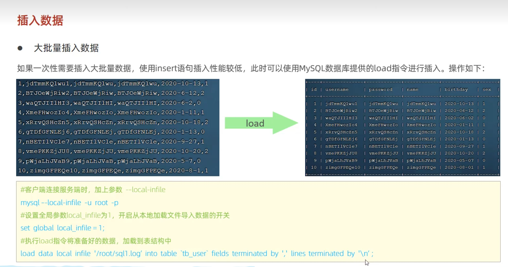

批量导入数据



先创建一个表
```
CREATE TABLE tb_user (
    id INT(11) NOT NULL AUTO_INCREMENT,
    name VARCHAR(20) NOT NULL,
    email VARCHAR(50) NOT NULL,
    description VARCHAR(50) NOT NULL,
    createdate DATE DEFAULT NULL,
    gender CHAR(1) DEFAULT NULL,
    dept_id INT(11) DEFAULT NULL,
    PRIMARY KEY (id),
    UNIQUE KEY unique_user_username (name),
    FOREIGN KEY (dept_id) REFERENCES Departments(id)
) ENGINE=INNODB DEFAULT CHARSET=utf8;
show tables;
```
121.199.28.61
数据库：testredies
python生成数据的位置：D:\study\PycharmProjects\pythonProject\高级技巧\randomSqpl.py
客户端连接服务端时，加上参数 --local-infile（这一行在bash/cmd界面输入）
```
```
设置全局参数local_infile为1，开启从本地加载文件导入数据的开关
```
set global local_infile = 1;
select @@local_infile;
```

然后执行插入数据：
```
load data local infile './load_data2.sql' into table tb_user fields terminated by ',' lines terminated by '\n';
```