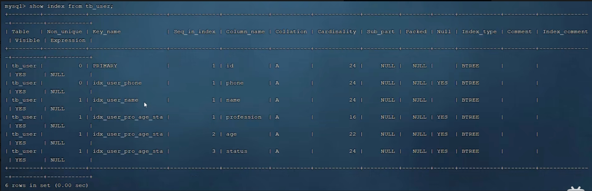

这张图片展示了使用 SHOW INDEX FROM tb_user; 命令查询 tb_user 表的索引信息。查询结果包含以下列信息：

+ Table: 表名（在此例中是 tb_user）
+ Non_unique: 索引是否允许重复。0 表示唯一索引，1 表示非唯一索引
+ Key_name: 索引的名称
+ Seq_in_index: 列在索引中的顺序
+ Column_name: 列名
+ Collation: 列的排序规则（一般是 A，表示升序）
+ Cardinality: 索引中唯一值的估计数量
+ Sub_part: 如果索引只包含列的一部分字符，则显示该部分字符的长度；如果是 NULL，表示整个列都被索引
+ Packed: 如果列存储使用压缩，显示压缩方法；如果是 NULL，表示未压缩
+ Null: 列是否允许 NULL 值
+ Index_type: 索引的类型（一般是 BTREE）
+ Comment: 注释
+ Index_comment: 索引的注释
具体数据如下：

##### 主键索引（PRIMARY）:
+ 列: id
+ 唯一索引（Non_unique 为 0）
+ BTREE 类型

##### 唯一索引 idx_user_phone:
+ 列: phone
+ 唯一索引（Non_unique 为 0）
+ BTREE 类型

##### 非唯一索引 idx_user_name:
+ 列: name
+ 非唯一索引（Non_unique 为 1）
+ BTREE 类型

##### 复合索引 idx_user_pro_age_sta:
+ 列: profession
+ 列: age
+ 列: status
+ 非唯一索引（Non_unique 为 1）
+ BTREE 类型