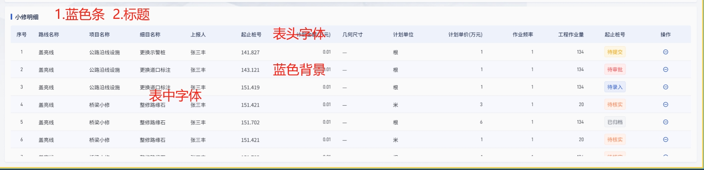

1.蓝色条
```css
width: 4px;
height: 16px;
gap: 0px;
opacity: 0px;
background: var(---, rgba(43, 88, 205, 1));
```

2.标题
```css
font-family: Noto Sans SC;
font-size: 16px;
font-weight: 500;
line-height: 22px;
text-align: left;
color: var(---, rgba(13, 26, 62, 1));
background: var(----, rgba(238, 242, 251, 1));
```

3.表头字体
```css
//styleName: 表格-表头;
font-family: Noto Sans SC;
font-size: 14px;
font-weight: 400;
line-height: 20px;
text-align: left;
color: var(---, rgba(13, 26, 62, 1));
```

4.蓝色背景

```css
height: 48px;
border: 1px 0px 1px 0px;
background: var(------, rgba(246, 248, 253, 1));
border-width: 1px, 0px, 1px, 0px;
border-style: solid;
border-color: var(---, rgba(234, 235, 239, 1));
```

5.表中字体
```css
font-family: Noto Sans SC;
font-size: 14px;
font-weight: 400;
line-height: 22px;
text-align: left;
color: var(---, rgba(54, 57, 65, 1));
```