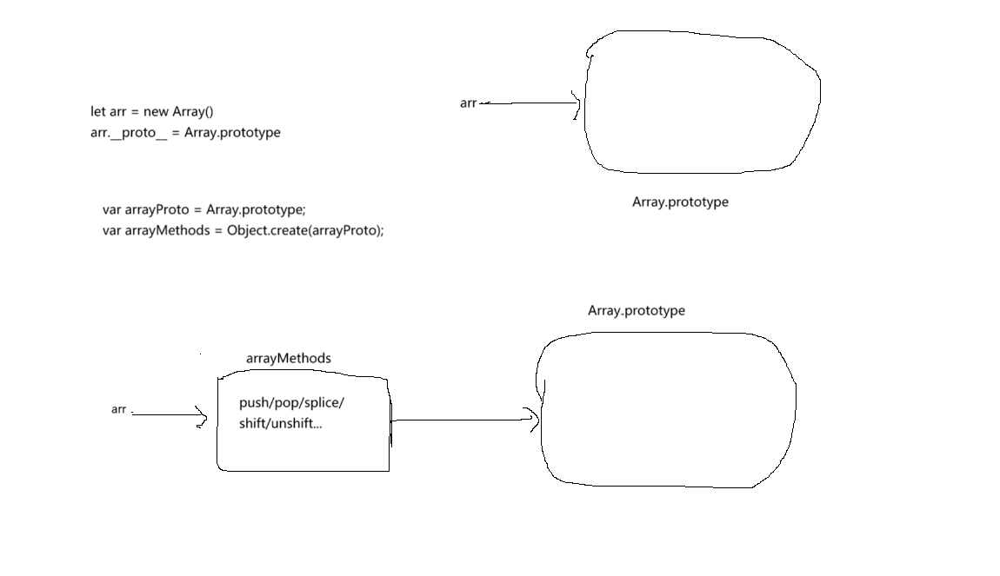

#### 数据监听

整体流程：找到每个数据，给它定义get和set方法，get做依赖收集，set触发watcher的渲染

实际逻辑有两个分支：
+ 对于数组的监听
+ 数组外数据的监听

##### 数组外数据的监听
walk(data)

##### 数组的监听
+ 当数组元素是基本数据类型的元素，那么，不需要为它的每个元素单独定义get和set方法，直接劫持数组的push、pop等方法，当执行对数组的操作后，更新watcher即可.
例子：[1,2,3,4]
+ 当数组元素为对象时，要监听这个对象的变化，于是给这个对象添加__ob__对象，如果已经有该对象，直接返回，说明已经为这个对象的属性设置了get和set方法，没有，则拿这个对象创建ob对象，执行walk为对象的每个可枚举属性添加get和set方法
例子：[{a:1},{a:2}]或原始数据类型:6



```javascript
var arrayProto = Array.prototype;
var arrayMethods = Object.create(arrayProto);

var methodsToPatch = [
  'push',
  'pop',
  'shift',
  'unshift',
  'splice',
  'sort',
  'reverse'
];

/**
  * Intercept mutating methods and emit events
  */
<!-- 遍历重写数组方法，在原有逻辑上增加加监听 -->
methodsToPatch.forEach(function (method) {
  // cache original method
  //拿到原方法
  var original = arrayProto[method];
  def(arrayMethods, method, function mutator () {
    var args = [], len = arguments.length;
    while ( len-- ) args[ len ] = arguments[ len ];

    var result = original.apply(this, args);
    var ob = this.__ob__;
    var inserted;
    switch (method) {
      case 'push':
      case 'unshift':
        inserted = args;
        break
      case 'splice':
        inserted = args.slice(2);
        break
    }
    if (inserted) { ob.observeArray(inserted); }
    // notify change
    ob.dep.notify();
    return result
  });
});
<!-- 劫持当前要监听对象的__proto__,这样这个对象的数组方法是重写后的 -->
function protoAugment (target, src) {
  /* eslint-disable no-proto */
  target.__proto__ = src;
  /* eslint-enable no-proto */
}

/**
  * Augment a target Object or Array by defining
  * hidden properties.
  */
/* istanbul ignore next */
function copyAugment (target, src, keys) {
  for (var i = 0, l = keys.length; i < l; i++) {
    var key = keys[i];
    def(target, key, src[key]);
  }
}

/**
  * Attempt to create an observer instance for a value,
  * returns the new observer if successfully observed,
  * or the existing observer if the value already has one.
  */
function observe (value, asRootData) {
  if (!isObject(value) || value instanceof VNode) {
    return
  }
  var ob;
  if (hasOwn(value, '__ob__') && value.__ob__ instanceof Observer) {
    ob = value.__ob__;
  } else if (
    shouldObserve &&
    !isServerRendering() &&
    (Array.isArray(value) || isPlainObject(value)) &&
    Object.isExtensible(value) &&
    !value._isVue
  ) {
    ob = new Observer(value);
  }
  if (asRootData && ob) {
    ob.vmCount++;
  }
  return ob
}
var Observer = function Observer (value) {
  this.value = value;
  this.dep = new Dep();
  this.vmCount = 0;
  // debugger
  def(value, '__ob__', this);
  if (Array.isArray(value)) {
    if (hasProto) {
      protoAugment(value, arrayMethods);
    } else {
      copyAugment(value, arrayMethods, arrayKeys);
    }
    this.observeArray(value);
  } else {
    this.walk(value);
  }
};
```
##### 非数组场景：
```var myobj = {a:1,b:2}```
initData(myobj) -> observe(myobj) -> ob = new Observer() -> def(myobj, '__ob__', this) -> this.walk(value) -> 遍历myobj: defineReactive$$1(myobj, keys[i]) -> a.get = ...;a.set = ...;b.get = ...,b.set = ...

##### 数组场景
```javascript
1.var myarr = [1,2];

initData(myarr) -> observe(myarr) -> ob = new Observer() -> def(myarr, '__ob__', this) -> protoAugment() -> myarr.__proto__ = arrayMethods -> observeArray -> return
劫持数组的方法的时候，执行watcher.notify更新视图

2.var myarr = [{a:1},{a:2}];

initData(myarr) -> observe(myarr) -> ob = new Observer() -> def(myarr, '__ob__', this) -> protoAugment() -> myarr.__proto__ = arrayMethods -> observeArray(遍历每个对象) -> hasOwn(value, '__ob__')
if (hasOwn(value, '__ob__')) {
  return __ob__
//如果某个对象已经创建了响应式，那么他已经有__ob__，直接返回即可。遍历下一个对象
} else {
  walk(myarr[i])
}
```

>def(value, '__ob__', this);这里的this就是当前创建的Observer对象，也就是ob,这句话将myobj和它的Observer对象进行了关联，实际为：myobj.__ob__ = ob，数组同理：myarr.__ob__ = ob