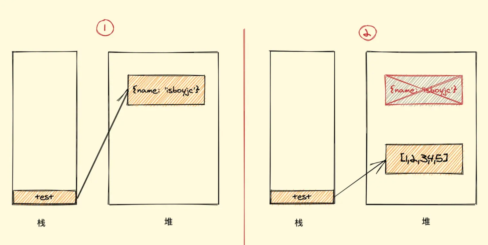
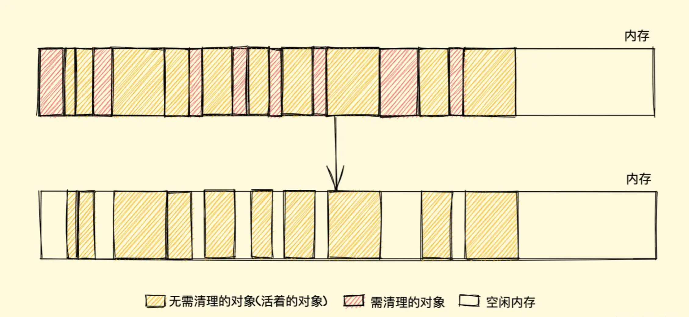
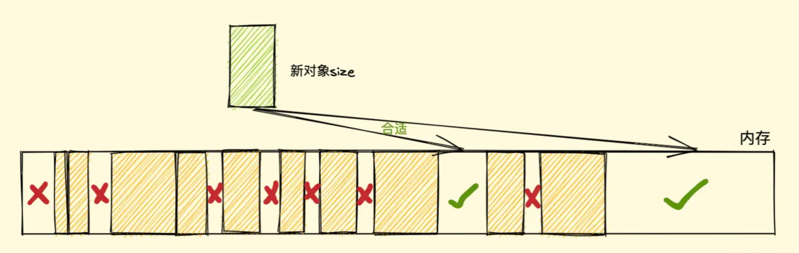
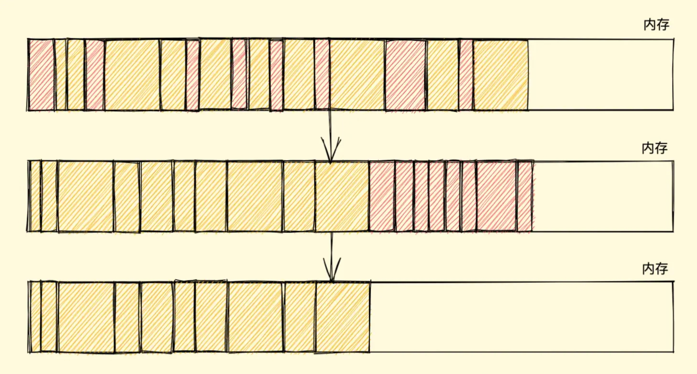

##### Garbage Collection 垃圾回收机制
```javascript
let test = {
  name: "isboyjc"
};
test = [1,2,3,4,5]
```


>栈：保存非全局的基本数据类型，包括对象的地址
堆：保存对象类型的数据，全局的基本数据类型也是在堆中的，因为全局指向window，而window是一个对象

#### 可达性
垃圾回收（Garbage Collection, GC）机制主要通过可达性（Reachability）来决定哪些对象可以被回收。可达性是指从根（root）开始，能否通过引用链找到某个对象。以下是关于可达性的详细说明：
###### 1. 根（Roots）
在 JavaScript 中，根通常是一些**全局变量**、**当前执行上下文中**的局部变量和**调用栈**中的变量。这些变量作为起点，可以引用其他对象。

###### 2. 可达性算法
可达性算法的主要思想是：从根开始，递归地查找所有能通过引用链访问到的对象。那些能被找到的对象被认为是可达的，而找不到的对象被认为是不可达的，意味着它们不再需要，能够被垃圾回收。

###### 3. 具体步骤
+ 标记阶段（Marking Phase）：
从根开始，递归地标记所有能访问到的对象。即从根出发，找到所有直接或间接引用的对象，并将这些对象标记为可达。
+ 清除阶段（Sweeping Phase）：
遍历所有对象，回收那些没有被标记为可达的对象。

```javascript
function example() {
    let obj1 = {};
    let obj2 = {};
    obj1.ref = obj2; // obj1引用了obj2
    obj2.ref = obj1; // obj2引用了obj1

    // 现在obj1和obj2是相互引用的，它们都是可达的
    return obj1;
}

// 当example函数执行完毕后，obj1和obj2依然是可达的，因为它们被返回的obj1引用着
```
###### 4.循环引用
```javascript
function createCycle() {
    let obj1 = {};
    let obj2 = {};
    obj1.ref = obj2;
    obj2.ref = obj1;
}

// 当createCycle函数执行完毕后，obj1和obj2不可达，将被垃圾回收
createCycle();
```
###### 5.弱引用
有时我们希望对某些对象持有“弱引用”，即使它们在可达性分析中也不影响垃圾回收。JavaScript 提供了 WeakMap 和 WeakSet 来实现这一点，它们对对象的引用是“弱”的，如果这些对象没有其他引用，它们就可以被垃圾回收。
```javascript
let weakMap = new WeakMap();
let obj = {};
weakMap.set(obj, "some value");

// 如果obj没有其他引用，它将会被垃圾回收，即使它在WeakMap中
obj = null;
```
#### gc的两种方式
##### 标记清除算法
就像它的名字一样，此算法分为 标记 和 清除 两个阶段，标记阶段即为所有活动对象做上标记，清除阶段则把没有标记（也就是非活动对象）销毁。
整个标记清除算法大致过程就像下面这样

+ 垃圾收集器在运行时会给内存中的所有变量都加上一个标记，假设内存中所有对象都是垃圾，全标记为0
+ 然后从各个根对象开始遍历，把不是垃圾的节点改成1
+ 清理所有标记为0的垃圾，销毁并回收它们所占用的内存空间
+ 最后，把所有内存中对象标记修改为0，等待下一轮垃圾回收

###### 优点
标记清除算法的优点只有一个，那就是实现比较简单，打标记也无非打与不打两种情况，这使得一位二进制位（0和1）就可以为其标记，非常简单
###### 缺点
标记清除算法有一个很大的缺点，就是在清除之后，剩余的对象内存位置是不变的，也会导致空闲内存空间是不连续的，出现了 内存碎片（如下图），并且由于剩余空闲内存不是一整块，它是由不同大小内存组成的内存列表，这就牵扯出了内存分配的问题


假设我们新建对象分配内存时需要大小为 size，由于空闲内存是间断的、不连续的，则需要对空闲内存列表进行一次单向遍历找出大于等于 size 的块才能为其分配（如下图）


那如何找到合适的块呢？我们可以采取下面三种分配策略


+ First-fit，找到大于等于 size 的块立即返回


+ Best-fit，遍历整个空闲列表，返回大于等于 size 的最小分块


+ Worst-fit，遍历整个空闲列表，找到最大的分块，然后切成两部分，一部分 size 大小，并将该部分返回


这三种策略里面 Worst-fit 的空间利用率看起来是最合理，但实际上切分之后会造成更多的小块，形成内存碎片，所以不推荐使用，对于 First-fit 和 Best-fit 来说，考虑到分配的速度和效率 First-fit 是更为明智的选择
综上所述，标记清除算法或者说策略就有两个很明显的缺点

+ 内存碎片化，空闲内存块是不连续的，容易出现很多空闲内存块，还可能会出现分配所需内存过大的对象时找不到合适的块
+ 分配速度慢，因为即便是使用 First-fit 策略，其操作仍是一个 O(n) 的操作，最坏情况是每次都要遍历到最后，同时因为碎片化，大对象的分配效率会更慢

归根结底，标记清除算法的缺点在于清除之后剩余的对象位置不变而导致的空闲内存不连续，所以只要解决这一点，两个缺点都可以完美解决了
而 标记整理（Mark-Compact）算法 就可以有效地解决，它的标记阶段和标记清除算法没有什么不同，只是标记结束后，标记整理算法会将活着的对象（即不需要清理的对象）向内存的一端移动，最后清理掉边界的内存（如下图）




##### 引用计数
它的策略是跟踪记录每个变量值被使用的次数
+ 当声明了一个变量并且将一个引用类型赋值给该变量的时候这个值的引用次数就为 1
+ 如果同一个值又被赋给另一个变量，那么引用数加 1
+ 如果该变量的值被其他的值覆盖了，则引用次数减 1
+ 当这个值的引用次数变为 0 的时候，说明没有变量在使用，这个值没法被访问了，回收空间，垃圾回收器会在运行的时候清理掉引用次数为 0 的值占用的内存
```javascript
let a = new Object() 	// 此对象的引用计数为 1（a引用）
let b = a 		// 此对象的引用计数是 2（a,b引用）
a = null  		// 此对象的引用计数为 1（b引用）
b = null 	 	// 此对象的引用计数为 0（无引用）
...			// GC 回收此对象
```
这种方式是不是很简单？确实很简单，不过在引用计数这种算法出现没多久，就遇到了一个很严重的问题——循环引用，即对象 A 有一个指针指向对象 B，而对象 B 也引用了对象 A ，如下面这个例子

```javascript
function test(){
  let A = new Object()
  let B = new Object()
  
  A.b = B
  B.a = A
}
```
如上所示，对象 A 和 B 通过各自的属性相互引用着，按照上文的引用计数策略，它们的引用数量都是 2，但是，在函数 test 执行完成之后，对象 A 和 B 是要被清理的，但使用引用计数则不会被清理，因为它们的引用数量不会变成 0，假如此函数在程序中被多次调用，那么就会造成大量的内存不会被释放
我们再用标记清除的角度看一下，当函数结束后，两个对象都不在作用域中，A 和 B 都会被当作非活动对象来清除掉，相比之下，引用计数则不会释放，也就会造成大量无用内存占用，这也是后来放弃引用计数，使用标记清除的原因之一

>在 IE8 以及更早版本的 IE 中，BOM 和 DOM 对象并非是原生 JavaScript 对象，它是由 C++ 实现的 组件对象模型对象（COM，Component Object Model），而 COM 对象使用 引用计数算法来实现垃圾回收，所以即使浏览器使用的是标记清除算法，只要涉及到  COM 对象的循环引用，就还是无法被回收掉，就比如两个互相引用的 DOM 对象等等，而想要解决循环引用，需要将引用地址置为 null 来切断变量与之前引用值的关系，如下 
```javascript
// COM对象
let ele = document.getElementById("xxx")
let obj = new Object()

// 造成循环引用
obj.ele = ele
ele.obj = obj

// 切断引用关系
obj.ele = null
ele.obj = null
```
>不过在 IE9 及以后的 BOM 与 DOM 对象都改成了 JavaScript 对象，也就避免了上面的问题
此处参考 JavaScript高级程序设计 第四版 4.3.2 小节
##### 优点
引用计数算法的优点我们对比标记清除来看就会清晰很多，首先引用计数在引用值为 0 时，也就是在变成垃圾的那一刻就会被回收，所以它可以立即回收垃圾
而标记清除算法需要每隔一段时间进行一次，那在应用程序（JS脚本）运行过程中线程就必须要暂停去执行一段时间的 GC，另外，标记清除算法需要遍历堆里的活动以及非活动对象来清除，而引用计数则只需要在引用时计数就可以了
##### 缺点
引用计数的缺点想必大家也都很明朗了，首先它需要一个计数器，而此计数器需要占很大的位置，因为我们也不知道被引用数量的上限，还有就是无法解决循环引用无法回收的问题，这也是最严重的


https://juejin.cn/post/6981588276356317214
线程：https://juejin.cn/post/6844904050543034376