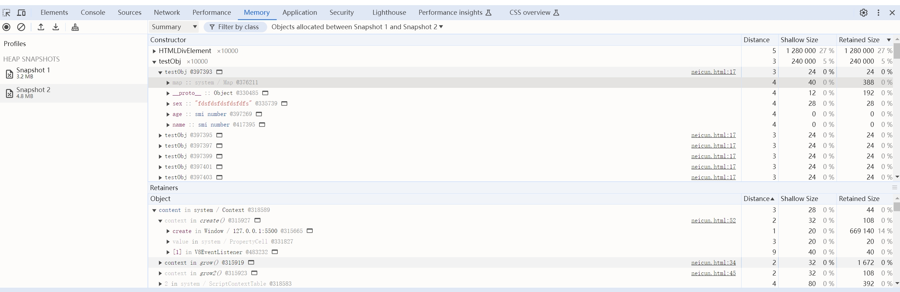
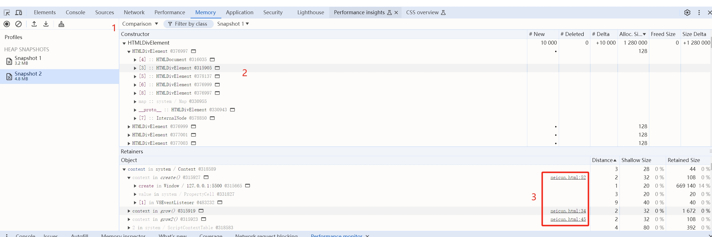
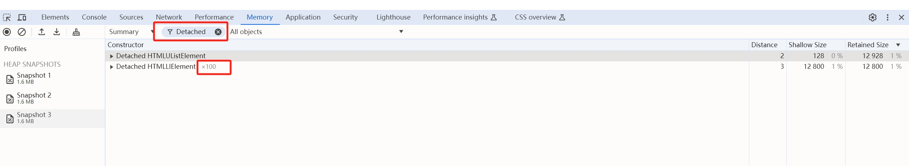
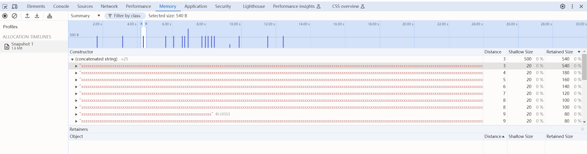
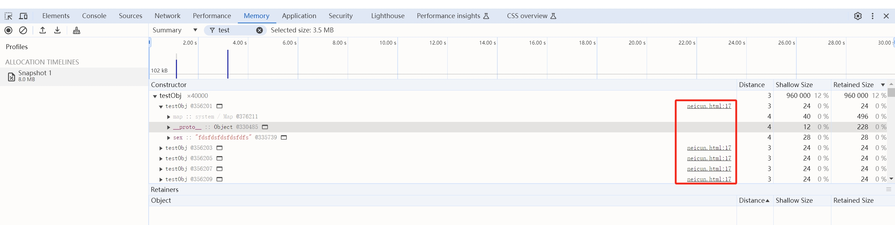
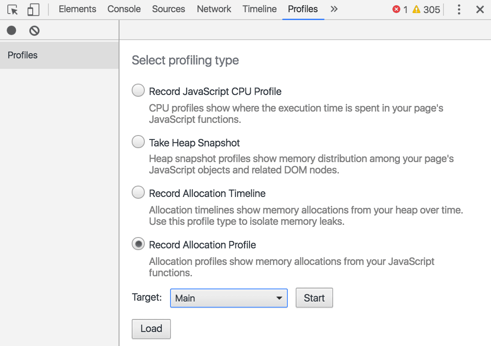
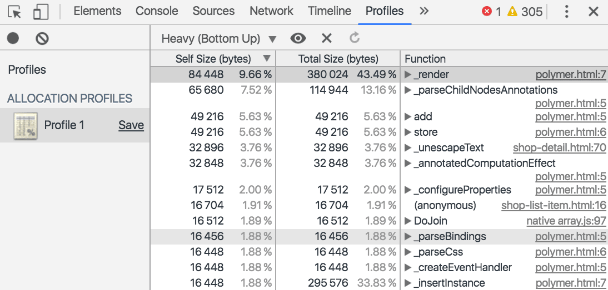
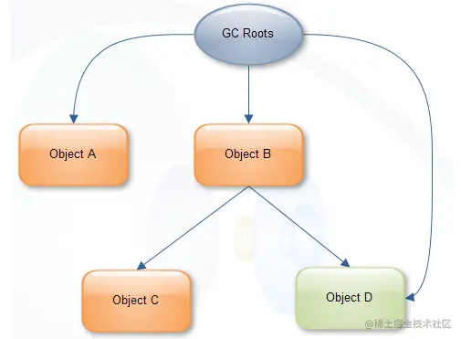

##### 1.Take Heap Snapshot:创建堆快照用来显示网页上的JS对象和相关的DOM节点的内存分布情况。
利用该工具你可以创建JS的堆快照、内存分析图、对比堆快照以及定位内存泄漏问题。
选中Take Heap Snapshot,点击Take Snapshot按钮即可获取快照，在每一次获取快照前都会自动执行垃圾回收操作。
堆快照提供了不同的视角来进行查看：
+  Summary : 该视图按照构造函数进行分组，用它可以捕获对象和它们使用的内存情况，对于跟踪定位DOM节点的内存泄漏特别有用。
+ Comparison : 对比两个快照的差别，用它可以对比某个操作前后的内存快照。分析操作前后的内存释放情况以及它的引用计数，便于你确认内存是否存在泄漏以及造成的原因。
+ Containment : 该视图可以探测堆的具体内容，它提供了一个更适合的视图来查看对象结构，有助于分析对象的引用情况，使用它可以分析闭包和进行更深层次的对象分析。
+ Statistics : 统计视图。
```javascript
class testObj{
  constructor (name, age, sex) {
    this.name = name
    this.age = age
    this.sex = sex
  }
}

var x = [];
let content =document.getElementById('content')
var fragment = document.createDocumentFragment();
function grow() {
    for (var i = 0; i < 10000; i++) {
        fragment.appendChild(document.createElement('div'));
        x.push(new testObj(23,32,'fdsfdsfdsfdsfdfs'))
    }
    content.appendChild(fragment)
}
```
1) Summary

2) Comparison



只有当页面的 DOM 树或 JavaScript 代码都没有引用 DOM 节点时，系统才会对 DOM 节点进行垃圾回收。如果某个节点已从 DOM 树中移除，但某些 JavaScript 仍会引用该节点，则该节点称为“已分离”。
打开memory面板，录制，输入Detached.png过滤，能看到又100个泄露的dom节点，正式上面代码生成的那100个


##### 2.timeline时间线记录内存快照
Record Allocation Timeline 从整个Heap角度记录内存的分配信息的时间轴信息，利用这个可以实现隔离内存泄漏问题。
你可以在蓝色竖线上通过缩放来过滤构造器窗格来仅仅显示在指定的时间帧内的被分配的对象。
录制过程中，在时间线上会出现一些蓝色竖条，这些蓝色竖条代表一个新的内存分配，这个新的内存分配都可以会有潜在的内存泄露问题。
通过展开对象并点击它的值则可以在Object窗格中查看更多新分配的对象细节。
在记录的过程操作界面，当有内存增加时，会在时间轴上做标记
```javascript
var x = [];

function grow() {
  x.push(new Array(1000000).join('x'));
}

document.getElementById('grow').addEventListener('click', grow);
```
蓝色竖线表示新的内存分配


```javascript
class testObj{
  constructor (name, age, sex) {
    this.name = name
    this.age = age
    this.sex = sex
  }
}

var x = [];
let content =document.getElementById('content')
var fragment = document.createDocumentFragment();
function grow() {
    for (var i = 0; i < 10000; i++) {
        fragment.appendChild(document.createElement('div'));
        x.push(new testObj(23,32,'fdsfdsfdsfdsfdfs'))
    }
    content.appendChild(fragment)
}
```



##### 3.Record Allocation Profile:从JS函数角度记录内存的分配信息


1.选中 Allocation Sampling 单选按钮。如果页面上有工作器，您可以使用 2.Start 按钮旁边的下拉菜单将其选为分析目标。
3.按 Start 按钮。
4.在您想调查的网页上执行操作。
完成所有操作后，按停止按钮。

开发者工具会按函数显示内存分配明细。默认视图为 Heavy (Bottom Up)，它在顶部显示分配了最多内存的函数。


##### 发现频繁的垃圾回收
如果您的网页经常暂停，则可能存在垃圾回收问题。

您可以使用 Chrome 任务管理器或时间轴内存记录来发现频繁的垃圾回收。在任务管理器中，Memory 或 JavaScript Memory 值频繁上升和下降表示垃圾回收频繁。在时间轴记录中，JS 堆或节点计数图表频繁上升和下降表示存在频繁的垃圾回收。

确定问题后，您可以使用分配时间轴记录来找出内存分配的位置以及导致分配的函数。
视频效果 pinfan1.mp4

##### Shallow Size 与 Retained Size关系


B的shallow size = B;
B的retained size = B shallow size + C retained size + D retained size;
##### 单位
Shallow Size 与 Retained Size的单位是Byte

内存泄漏代码示例：
```javascript
<button id="create">分离</button>

<script>
var detachedTree;

function create() {
    var ul = document.createElement('ul');
    for (var i = 0; i < 100; i++) {
        var li = document.createElement('li');
        ul.appendChild(li);
    }
    detachedTree = ul;
}

document.getElementById('create').addEventListener('click', create);
<script>
```

