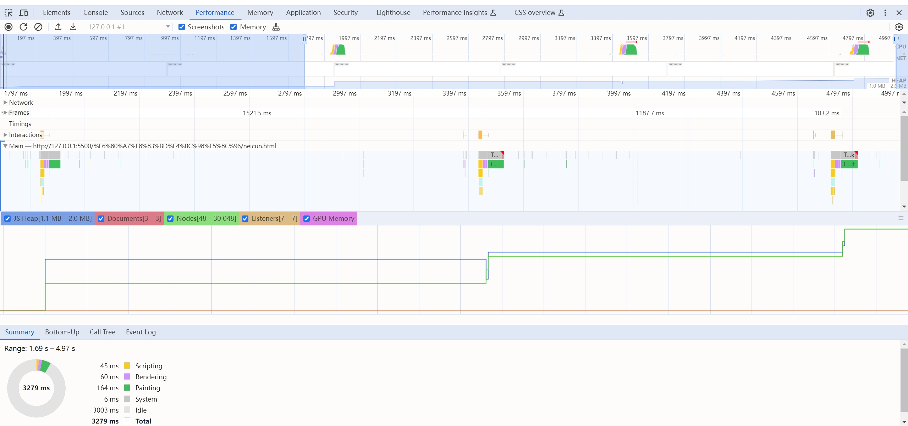
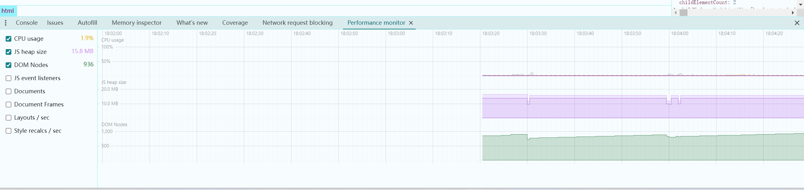
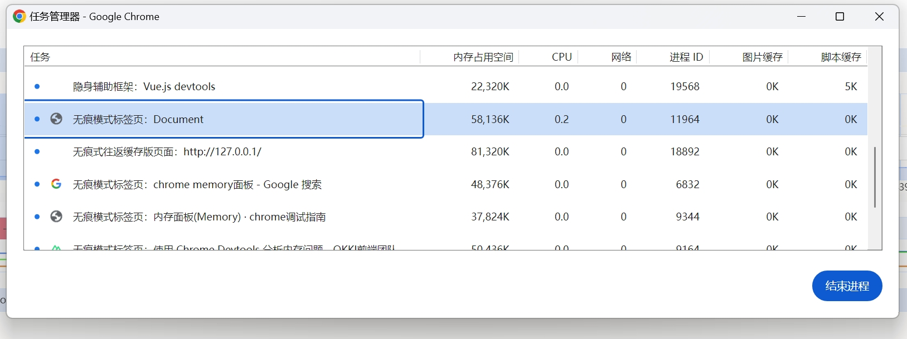

https://developer.chrome.com/docs/devtools/memory-problems/heap-snapshots?hl=zh-cn
https://developer.chrome.com/docs/devtools/performance?hl=zh-cn
https://web.dev/articles/avoid-large-complex-layouts-and-layout-thrashing?hl=zh-cn
##### performance

##### performanceMonitor
performanceMonitor面板实时观看js heap和dom节点等信息的变化
在控制台ctrl+shift+p，然后输入 show performance mo...即可出现此面板

+ CPU useage -- 当前 CPU 占用情况。
+ JS Heap size -- 堆内存使用情况。
+ DOM nodes -- DOM 节点数量
+ JS event Listeners -- js 事件监听器的数量
+ Documents -- 实时文档资源的数量
+ Document frames -- 页面上活动框架的数量（iframe 和 workers）
+ Layout/sec -- 浏览器必须重新布局 DOM 的速率
+ Style recalc/sec -- 浏览器必须重新计算样式的速率

###### CPU useage

通常是大量的 DOM 渲染/操作，或者非常大的运算量导致的。常见的场景中，例如长列表渲染， 大量的表单渲染，截图等一些功能都会造成 CPU 的上升。 建议在开发过程中关注异常的 CPU 占用情况，这往往都是一个优化点。

###### Js heap size

浏览器有非常强大内存的垃圾回收机制。通常情况下我们 web 开发者不需要太关注内存的使用情况。如果我们关注该参数，可以看见在页面静止不动几秒后渐渐减少，此时就是浏览器的垃圾回收机制在发挥作用。
如果出现堆内存持续处于高位，一直没有下降的情况，就需要对业务进行分析，是否有数据处于异常新增的状态，导致无法被浏览器自动回收。常见的异常情况有：定义了大量的闭包，有非常高频的循环一直在给对象赋新值，或者有很多定时器一直在执行一些代码。

##### 任务管理器
shift + esc可以唤起浏览器任务管理器，查看内存变化情况
