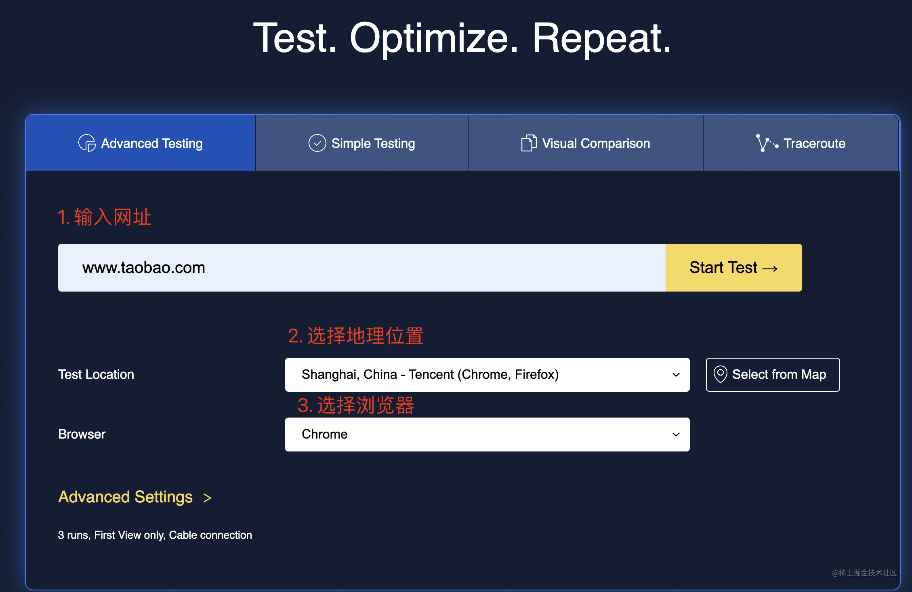
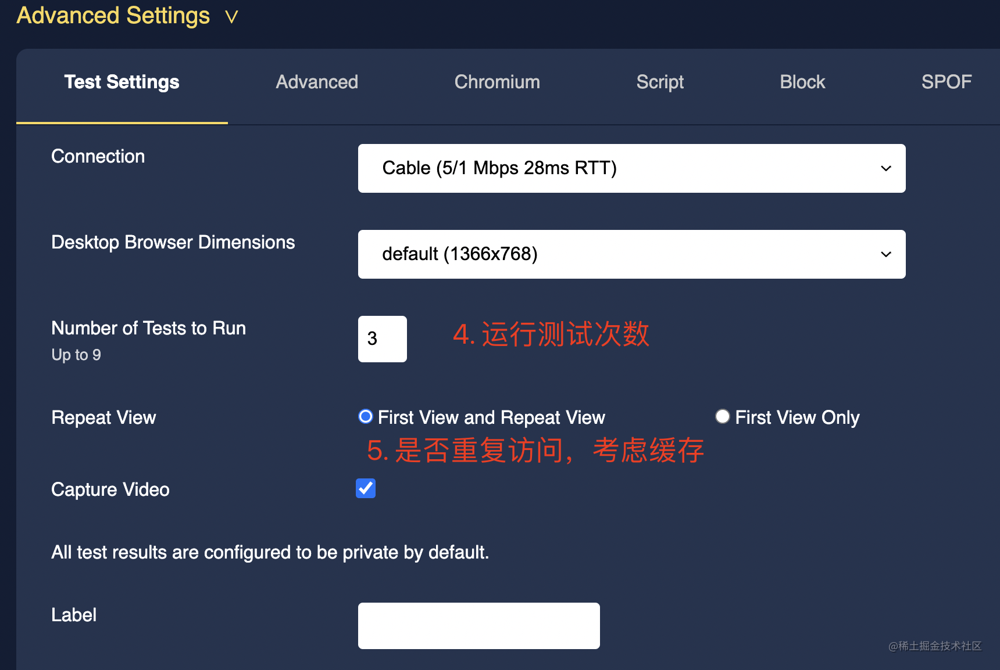
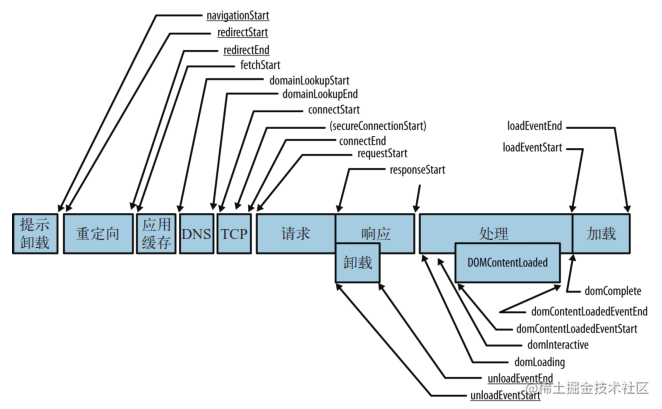
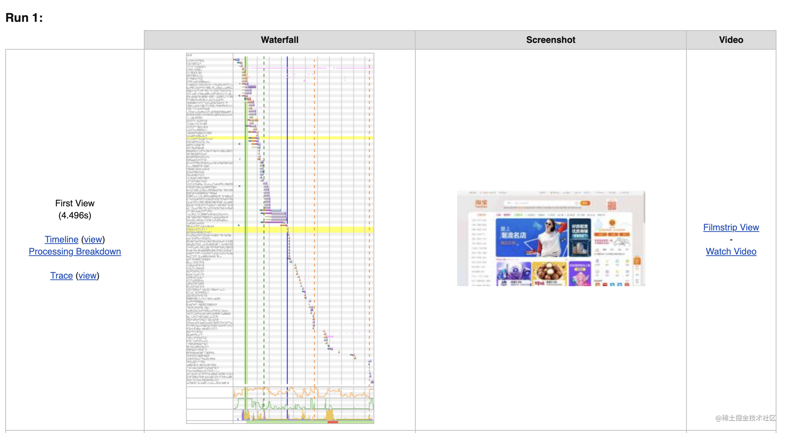
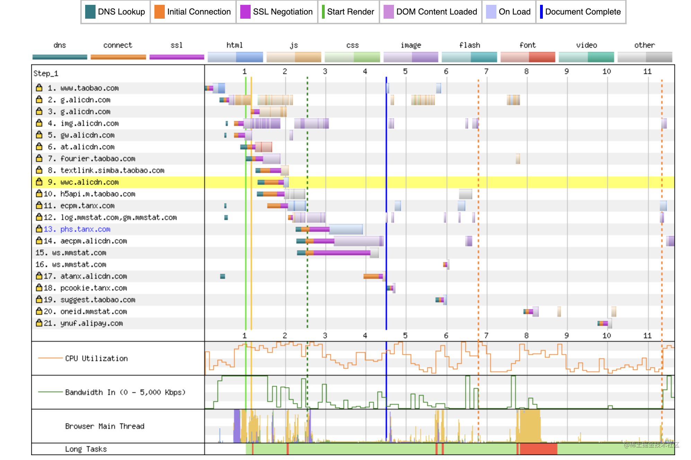
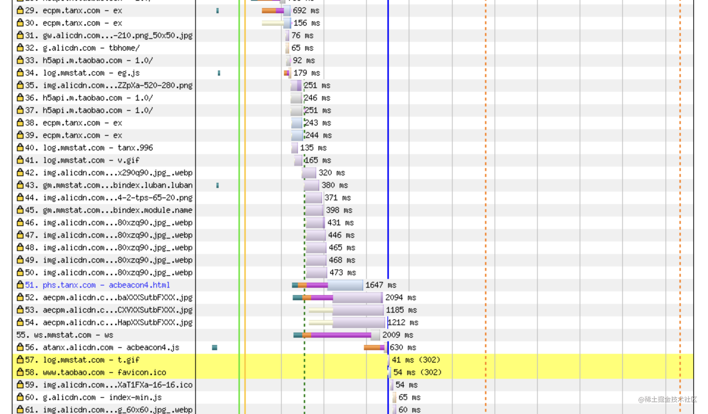

## 前言

工欲善其事，必先利其器。了解完性能指标之后，性能优化的目标已经明确了。接下来我们借助一些性能测量工具，明确网页距离优化目标之前还有多大的差距。一个好的工具可以让你事半功倍，接下来我将用3篇文章分别介绍3个主流的测量工具：

1. Chrome DevTools Performance 主要用于日常开发过程中分析运行时的性能表现。
2. Lighthouse 用来生成网页的性能评测报告。
3. WebPageTest 用来进行整体的网站质量评估、一站式性能评估。

有了这3个工具我们就可以从多个维度对网站性能进行全方位的评估。

## 性能测量工具-WebPageTest

WebPagetest的核心是用于测量和分析网页的性能。它是 google 开源项目**《make the web faster 》**的子项目，它本来是 AOL 内部使用的工具，后来在2008年基于BSD开源。其官方网址如下：http://www.webpagetest.org/

原理：WebPageTest是一个PHP网站，用户输入网址、地点、自定义脚本等信息后，参数发送到后台。后台做些逻辑处理，再通过浏览器相关的代理程序，启动Chrome、Firefox或IE。浏览器执行完后将数据传回给后台，后台再将数据保存起来，最后通过各种形式（图、表格、列等），将分析数据过的数据，呈现给用户。

### 导航栏

首先打开WebPageTest 官网，可以看到如下界面：


1. Test History：能查看到测试历史记录。
2. API：webgetest API Key 允许开发人员在其工作流中自动执行性能测试，以不断提供更快的网页。WebPageTest 支持的扩展开发，只要申请到一个key后，就可以根据提供的API做开发。不过调用次数都会有限制，所以如果要做还是在自己本地或内网布置一个WebPageTest的环境。
3. Forums：论坛信息，里面有许多提问和回答，覆盖面非常广。
4. Docs：英文版工具文档，中文文档可以参照这个网址 https://github.com/pwstrick/WebPagetest-Docs
5. Blog：博客，里面是一些 WebpageTest 的一些最佳实践方案等
6. About：给出了WebPageTest的[Github地址](https://link.zhihu.com/?target=https%3A//github.com/WPO-Foundation/webpagetest)，以及发布版的[下载地址](https://link.zhihu.com/?target=https%3A//github.com/WPO-Foundation/webpagetest/releases/tag/WebPageTest-3.0)等信息。

### 基本使用

基础配置

1. 输入网页网址：确定要测试的页面后，转到WebPagetest并为其指定要测试的页面的URL，这个地址可以是首页也可以是详情页。
2. 选择地理位置：WebPagetest具有位于世界各地的测试机器，你应该从接近用户访问的位置进行测试，从列表中选择一个位置，或者单击`Select from Map`按钮，从地图视图中选择一个位置（只需单击气球🎈，然后确定）
3. 选择浏览器：**不同的位置支持不同的浏览器**，如果给定的位置没有正在寻找的浏览器，可以尝试不同的位置。通常建议使用chrome浏览器。



高级配置

1. 运行测试次数：为保证测试结果的准确性，每次运行都会测试多次
2. 是否重复访问：因为重复访问会优先走缓存，所以结果可能会有差别
3. 提交测试：一切配置完成后，点击`Start Test`按钮，请求将发送到测试位置进行测试。测试可能需要一段时间才能运行，具体取决于有多少次测试（在测试之前至少有一分钟的测试时间，但是它的时间甚至更长）。一旦测试完成，你将得到结果。



### 本地部署

官网中只能测试一些外网能访问的网站，但是往往开发过程中有些项目我们都发布在公司内部的局域网内，所以就需要将WebPagetest部署到本地，使用本地的网络环境来测试性能。

> 注意：这里提到的本地部署，是指**本地局域网内服务器上部署**的网站，不是本地电脑的locallhost，因为在本地测试locallhost往往是不准确的，因为大多数情况下，本地开发调试的页面都是webpack dev sever服务器，资源没有经过压缩，所以加载速度也会很慢，和线上环境的结果往往会大相径庭。

具体步骤如下：

1. 下载并安装docker镜像，下载地址 https://docs.docker.com/get-docker/

   为什么安装docker镜像？docker类似于一个虚拟机，在虚拟机上下载**WebPageTest**的镜像，我们就是不需要独立安装WebPageTest这个软件了，这样可以**不受系统限制**，完全独立出一套虚拟的环境，通过端口映射到本地服务。

2. 拉取镜像，运行server实例和agent实例，操作如下：

   ```shell
   # 拉取镜像
   docker pull webpagetest
   docker pull webpagetest/agent
   
   # 运行server实例
   docker run -d -p 4000:80 webpagetest/server
   
   # 运行agent实例
   docker run -d -p 4000:80 --network="host" -e "SERVER_URL=http://localhost:4000/work/" -e "LOCATION=Test" webpagetest/agent
   ```

3. 访问http://localhost:4000，会看到 WebPagetest 官网一样的页面，在这个页面中输入本地其它端口的网址，我们就可以测试本地服务的性能了。

### 结果分析

#### 1. 优化等级

在结果页面的顶部是一组最关键的性能优化等级。涵盖了适用于所有网站的基本优化，任何不是A或B的都需要进行进一步的优化.


| 字母等级 | 占比      |
| -------- | --------- |
| A        | 90%+      |
| B        | 80% ~ 89% |
| C        | 70% ~ 79% |
| D        | 60% ~ 69% |
| F        | 0% ~ 59%  |

#### 2. 性能指标总结


结果页顶部的数据表提供了有关已加载页面的一些高级信息，其中首次和重复访问视图的指标都有清晰的看到首次和重复视图访问的结果。

首次视图(First View)：首次视图的测试，将会把浏览器的缓存和Cookie清除，表示访问者第一次访问该网页将体验到的情况。

重复视图(Repeat View)：重复视图会在首次视图测试后立即执行，不会清除任何内容。浏览器窗口在`First View`测试后关闭，然后启动新浏览器以执行`Repeat View`测试。重复视图测试模拟的是用户离开页面后，马上再进入此页面的场景。

除此之外，这里介绍几个关键指标：

1. 首字节时间（Time To First Byte）：首字节时间（通常缩写为TTFB）指的是被测量为从初始化请求，到服务器响应的第一个字节，被浏览器接收的时间（不包括DNS查询、TCP连接的时间）。
2. 页面渲染时间(Start Render）：测量的时间是从初始化请求，到第一个内容被绘制到浏览器显示的时间。`Start Render`是通过捕获页面加载的视频，并在浏览器第一次显示除空白页之外的其他内容时查看每个帧来衡量的。它只能在实验室测量，通常是最准确的测量。
3. 速度指数（Speed Index）：速度指数是一个计算的指标，用来衡量页面渲染用户可见内容的迅速程度（越低越好）。关于计算方法的更多信息，请点击此处查看。
4. 阻塞交互时间（Total Blocking Time）：是指页面阻塞，用户不能进行交互的累计时间，这里可以看到二次访问时资源缓存减少了阻塞时间。
5. 文档加载完毕(Document Complete)：从初始化请求，到加载所有静态内容（图片、CSS、JavaScript等），但可能不包括由JavaScript执行触发的内容，可以理解为开始执行`window.onload`。
6. 页面所有元素加载时间(Fully Loaded)：指的是从初始化请求，到Document Complete后，2秒内（中间几百毫秒轮询）没有网络活动的时间，但这2秒是不包括在测量中的，所以会出现两个差值大于或小于2秒。

**首字节加载时间和首字节时间的区别**

首字节加载时间（First Byte Time）：是指浏览器收到HTML内容的第一个字节时间，包括DNS查找、TCP连接、SSL协商（如果是HTTPS请求）和TTFB。

首字节时间 TTFB（Time To First Byte）：首字节是指被测量为从初始化请求，到服务器响应的第一个字节，被浏览器接收的时间（不包括DNS查询、TCP连接的时间）。我理解TTFB的计算是从下图中requestStart到responseStart这之间的时间，也就是请求发送出去的时间。



所以，首字节加载时间 = DNS查找时间+TCP连接时间+SSL协商时间+TTFB请求发送出去的时间

#### 3. waterfall chart 请求瀑布图



在结果页的下方我们可以看到每次运行显示的瀑布图，点击进去可以看到具体的参数详情，如下图所示



在这张图上我们可以看到所有的请求资源都列举了出来，里面的信息比 Chrome DevTools给出的信息更加详细，例如下方的几个指标：

1. Browser Main Thread：浏览器主线程占用情况，什么时间比较忙
2. Long Tasks：长任务时间，也就是页面的科技可交互时间，红色区域代表阻塞时间
3. Bandwidth In：带宽
4. CPU Utization：CPU占用情况

除此之外，在下图中我们还可以看到一些优化的点，比如42-50这些并行请求的图片资源减少了资源加载时间，还有57-58黄色高亮部分资源发生了重定向，WebpageTest 提示我们这里资源发生了变化，可以优化为不进行资源重定向。



## 总结

1. WebpageTest的使用方式：访问官网测试、安装本地镜像测试
2. WebpageTest的关键指标：首字节时间（First Byte）、页面渲染时间(Start Render）、速度指数（Speed Index）、阻塞交互时间（Total Blocking Time）、文档加载完毕(Document Complete)、页面所有元素加载时间(Fully Loaded)
3. 首字节加载时间 = DNS查找时间 + TCP连接时间 + SSL协商时间 + TTFB请求发送出去的时间

## 参考资料

1. [Web性能优化工具WebPageTest（一）——总览与配置](https://zhuanlan.zhihu.com/p/45896011)
2. [Web性能优化工具WebPageTest（二）——性能数据](https://zhuanlan.zhihu.com/p/45896237)
3. [Web性能优化工具WebPageTest（三）——本地部署(Windows 7版本)](https://zhuanlan.zhihu.com/p/45896680)

