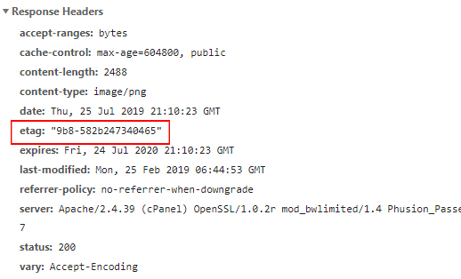

##### 协商缓存（max-age和expires）和强制缓存（last-modified/if-modified-since和etag/if-none-match）：
他们可以配合使用，先设置强制缓存，当强制缓存时间过期后，去服务器请求资源，用协商缓存验证资源是否新鲜，再决定返回304还是200，同时重置强制缓
存过期时间，下次请求的时候就会再次走强制缓存。
也可以设置no-cache，每次都走协商缓存，向服务器验证后再决定是否取缓存。

##### 缓存设置方式
通常有两种操作手段对浏览器缓存进行设置, 一个是通过页面指令声明来设置, 另外一个是通过编程方式来设置.
1. 设置HTTP报文的头标：
```javascript
res.header('Cache-Control', 'max-age=10') // 设置缓存有效期为10秒。这是强缓存，用户刷新或者强制刷新浏览器都只能取缓存内容
res.header('Cache-Control', 'no-cache') // 不强制缓存，每次先从服务器验证缓存，在决定是否去缓存
res.header('Cache-Control', 'no-store')    // 不缓存
res.header('expires', Date.now()) // 设置缓存有效期为某一时间点。这是强缓存，用户刷新或者强制刷新浏览器都只能取缓存内容
```
或：
Nginx的ngx_http_headers_module模块可以对Cache-Control头相关的东西进行配置, 比如:
```javascript
expires     24h;
expires     0;
expires     -1;
expires     epoch;
add_header  Cache-Control  private;
```


2. nginx上设置：
```javascript
if ($request_uri ~* "^/$|^/search/.+/|^/company/.+/") {
   add_header    Cache-Control  max-age=3600;
}
```
```javascript
location ~ .*\.(css|js|swf|php|htm|html )$ {
      add_header Cache-Control no-store;
}
```

```javascript
location ~ .*\.(js|css)$ {
     expires 10d;
}
```
将html结尾的请求加上no-cache
```javascript
location / {
    access_log /data/nginx/log/xxx.log api;
    root /home/www/html;
    if ($request_filename ~ .*\.(htm|html)$)
     {
            add_header Cache-Control no-cache;
     }
}
```


###### 设置 ETags 来控制缓存


服务器设置etag
```javascript
HTTP/1.1 200 OK
Last-Modified: Tue, 12 Dec 2006 03:03:59 GMT
ETag: "10c24bc-4ab-457e1c1f"
Content-Length: 12195
```
之后，如果浏览器要验证文件，它用 If-None-Match 头部来传 ETag 给服务器。如果 ETag 匹配，服务器返回 304（文件未变化），就不下载内容。这样就减少了 12195 个字节的响应体。Etag 通过文件版本标识，方便服务器判断请求的内容是否有更新，如果没有就响应 304，避免重新下载：

```javascript
GET /i/yahoo.gif HTTP/1.1
Host: us.yimg.com
If-Modified-Since: Tue, 12 Dec 2006 03:03:59 GMT
If-None-Match: "10c24bc-4ab-457e1c1f"
HTTP/1.1 304 Not Modified
```
ETag 的问题在于，通常使用文件的某些属性来构造它，这些属性对于特定的网站服务器来说是唯一的。在集群的情况下，当浏览器从一台服务器上获取了原始文件之后又尝试向另一台服务器来验证文件时，ETag 是不匹配的。
为什么大公司不太愿意用etag?
因为大公司好多是使用web集群或者说负载均衡，
在web服务器只有一台的情况，请求内容的唯一性可以由Etag来确定，但是如果是多台web服务器在负载均衡设备下提供对外服务，尽管各web服务器上的组件内容完全一致，但是由于在不同的服务器上Inode是不同的，因此对应生成的Etag也是不一样的 (关于 Inode 详细信息可以看这个 https://www.ruanyifeng.com/blog/2011/12/inode.html)

在这种情况下，尽管请求的是同一个未发生变化的组件，但是由于Etag的不同，导致Apache服务器不再返回304 Not Modified，而是返回了200 OK和实际的组件内容（尽管事实上内容不曾发生变化），大大浪费了带宽。

所以有人建议使用WEB集群时不要使用ETag

这个问题其实很好解决,因为多服务器时,INode不一样,所以不同的服务器生成的ETag不一样,所以用户有可能重复下载(这时ETag就会不准),
明白了上面的原理和设置后,解决方法也很容易,让ETag只用后面二个参数,MTime和Size就好了.只要ETag的计算没有INode参于计算,就会很准了.
或者自定义Etag 的生成规则，只要避开那些因机器不同而导致差异的字段就可以了

Koa2里面的etag由于不涉及到Inode 以及其他受机器影响的字段，所以在集群模式下是可用的

###### Last-Modified
Last-Modified与if-modified-since：服务器端设置Last-Modified，客户端下次在请求会带上if-modified-since字段。测试时，系统自动添加了，
也可以自己来写逻辑
```javascript
```
```javascript
```
```javascript
```


https://www.cnblogs.com/yalong/p/15207547.html
