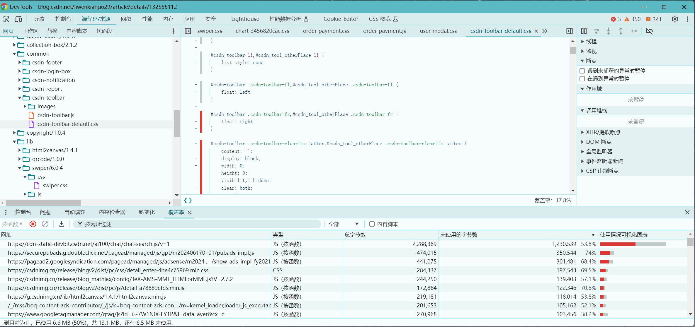

打开覆盖率面板：```ctrl + shift + p: coverage```

红色是未使用，可以通过覆盖率面板查看哪些资源未使用从而拆分代码和延迟加载或删除不再使用的资源



###### 避免使用 CSS @import 声明

```javascript
/* Don't do this: */
@import url('style.css');
```
与 <link> 元素在 HTML（link标签） 中的工作方式类似，CSS 中的 @import 声明允许您从样式表中导入外部 CSS 资源。这两种方法的主要区别在于，HTML <link> 元素是 HTML 响应的一部分，因此会比通过 @import 声明下载的 CSS 文件更早地被发现。

这是因为，为了让系统发现 @import 声明，必须先下载包含该声明的 CSS 文件。这会产生所谓的请求链（就 CSS 而言），请求链会延迟网页首次呈现所需的时间。另一个缺点是，预加载扫描器无法发现使用 @import 声明加载的样式表，因而会延迟发现会阻塞渲染的资源。

```javascript
<!-- Do this instead: -->
<link rel="stylesheet" href="style.css">
```

###### 内嵌关键 CSS
下载 CSS 文件所需的时间可能会增加网页的 FCP。在文档 <head> 中内嵌关键样式可以消除对 CSS 资源的网络请求，并且如果操作正确，可以在用户的浏览器缓存尚未准备好时缩短初始加载时间。其余 CSS 可以异步加载，也可以附加到 <body> 元素的末尾。

>关键术语：关键 CSS 是指渲染在初始视口中可见的内容所需的样式。初始视口的概念有时称为“首屏”。网页上的其余内容将保持未设置样式，而其余的 CSS 将异步加载。

```javascript
<head>
  <title>Page Title</title>
  <!-- ... -->
  <style>h1,h2{color:#000}h1{font-size:2em}h2{font-size:1.5em}</style>
</head>
<body>
  <!-- Other page markup... -->
  <link rel="stylesheet" href="non-critical.css">
</body>
```


https://web.dev/learn/performance/optimize-resource-loading?hl=zh-cn