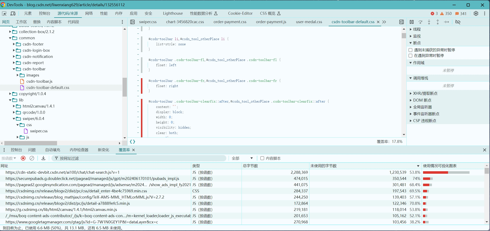

打开覆盖率面板：`ctrl + shift + p: coverage`

红色是未使用，可以通过覆盖率面板查看哪些资源未使用从而拆分代码和延迟加载或删除不再使用的资源



###### 避免使用 CSS @import 声明

```javascript
/* Don't do this: */
@import url('style.css');
```

与 <link> 元素在 HTML（link标签） 中的工作方式类似，CSS 中的 @import 声明允许您从样式表中导入外部 CSS 资源。这两种方法的主要区别在于，HTML <link> 元素是 HTML 响应的一部分，因此会比通过 @import 声明下载的 CSS 文件更早地被发现。

这是因为，为了让系统发现 @import 声明，必须先下载包含该声明的 CSS 文件。这会产生所谓的请求链（就 CSS 而言），请求链会延迟网页首次呈现所需的时间。另一个缺点是，预加载扫描器无法发现使用 @import 声明加载的样式表，因而会延迟发现会阻塞渲染的资源。

```javascript
<!-- Do this instead: -->
<link rel="stylesheet" href="style.css">
```

###### 内嵌关键 CSS

下载 CSS 文件所需的时间可能会增加网页的 FCP。在文档 <head> 中内嵌关键样式可以消除对 CSS 资源的网络请求，并且如果操作正确，可以在用户的浏览器缓存尚未准备好时缩短初始加载时间。其余 CSS 可以异步加载，也可以附加到 <body> 元素的末尾。

> 关键术语：关键 CSS 是指渲染在初始视口中可见的内容所需的样式。初始视口的概念有时称为“首屏”。网页上的其余内容将保持未设置样式，而其余的 CSS 将异步加载。

```javascript
<head>
  <title>Page Title</title>
  <!-- ... -->
  <style>h1,h2{color:#000}h1{font-size:2em}h2{font-size:1.5em}</style>
</head>
<body>
  <!-- Other page markup... -->
  <link rel="stylesheet" href="non-critical.css">
</body>
```

为什么会影响 FCP？
渲染阻塞（关键路径资源）
浏览器在构建渲染树（Render Tree）时需要结合 DOM 和 CSSOM。在默认情况下，浏览器遇到 <link rel="stylesheet"> 会暂停渲染，直到下载并解析完该 CSS 文件，才能继续构建渲染树。如果 CSS 下载慢，FCP 时间必然延迟。

CSSOM 构建是渲染的前提
没有 CSSOM，浏览器无法确定元素的样式和布局，因此不会渲染任何内容（即使 DOM 已解析完成）。所以CSS 是渲染关键路径上的必要资源。

具体影响场景
大体积 CSS 文件：下载时间更长。

慢网络或高延迟：CSS 请求耗时增加。

服务器响应慢：CSS 文件所在服务器延迟高。

CSS 放在 HTML 底部：浏览器更晚才发现并请求 CSS，延迟渲染开始时间。

如何减轻 CSS 对 FCP 的影响？
内联关键 CSS
将首屏渲染所需的关键样式直接内嵌在 HTML <style> 标签中，避免网络请求延迟。

异步加载非关键 CSS
对不影响首屏的 CSS，使用 preload 或 media 属性异步加载：

html

<link rel="preload" href="non-critical.css" as="style" onload="this.rel='stylesheet'">
<!-- 或者 -->
<link rel="stylesheet" href="print.css" media="print" onload="this.media='all'">
压缩与合并 CSS
减少文件大小，使用 Gzip/Brotli 压缩，合并多个 CSS 文件减少请求数。

删除无用 CSS
使用工具（如 PurgeCSS）移除未使用的样式。

使用 HTTP/2 或 CDN
提升传输效率，降低延迟。

1. CSS 会阻塞 HTML 的解析吗？
   不会直接阻塞 HTML 的解析，但会间接影响。

解析： 浏览器在下载 CSS 文件时，HTML 解析器通常会继续工作，将 HTML 标签转换成 DOM 节点。所以从技术上讲，CSS 的下载不阻塞 DOM 的构建。

但是有一个重要的例外： 如果 HTML 解析过程中遇到了没有 async 或 defer 属性的 <script> 标签，并且这个 <script> 标签之前有未下载/解析完的 CSS，那么这个 <script> 的执行会被阻塞，进而间接阻塞了后续的 HTML 解析。

原因： JavaScript 可能需要访问或修改当前已计算的 CSS 样式。为了保证脚本能获得正确的样式信息，浏览器必须先保证在它之前的所有 CSS（包括外链的）都已经下载并解析成 CSSOM。所以，CSS 会阻塞 JavaScript 的执行，而 JavaScript 的执行会阻塞 HTML 解析。

简单流程：

text
HTML 解析中 -> 遇到 `<link rel="stylesheet">` -> 异步下载 CSS，HTML 解析**继续**
↓
遇到 `<script>` (无 async/defer) -> 暂停 HTML 解析
↓
检查 CSS 是否已就绪 -> 如果 CSS 还在下载，则**等待 CSS 下载并解析完成**
↓
CSS 就绪后，才执行 JavaScript
↓
JavaScript 执行完毕，恢复 HTML 解析 2. CSS 会阻塞页面的渲染吗？
绝对会！这是对用户体验影响最大的部分。

渲染： 浏览器需要将 DOM 和 CSSOM 结合生成 渲染树，然后才能进行布局和绘制（即把像素画到屏幕上）。

关键点： 浏览器为了避免 “内容闪烁” 或 “无样式内容的闪现”，会遵循一条重要规则：在 CSSOM 构建完成之前，浏览器不会开始渲染页面（即不会进行首次绘制）。

这意味着，即便你的 DOM 已经全部解析完成，只要外部的 CSS 文件还在下载路上，屏幕就将是空白的，用户什么都看不到。

这就是为什么 CSS 是渲染关键路径上的阻塞资源，也是它直接影响 FCP 和 LCP 等核心 Web 性能指标的根本原因。

总结对比表
行为 是否被 CSS 下载阻塞？ 解释
HTML 解析 间接阻塞 本身不阻塞，但如果后面有同步 JS，JS 会等 CSS，JS 会阻塞解析。
页面渲染 直接完全阻塞 浏览器必须等 CSSOM 构建完成，才会进行首次绘制。
JavaScript 执行 直接阻塞 位于 CSS 后面的同步 JS 必须等 CSS 下载并解析完才能执行。
给开发者的重要启示
CSS 应尽早加载： 使用 <link rel="stylesheet"> 标签应放在 HTML 文档的 <head> 中，让浏览器能尽早发现并开始下载。

优化 CSS 交付：

关键路径 CSS 内联： 将首屏渲染所必需的关键样式直接内嵌在 <head> 的 <style> 标签里，彻底消除网络请求延迟。

非关键 CSS 异步加载： 使用 preload、media 属性等技巧，让非首屏必需的 CSS 不阻塞渲染。

注意 CSS 和 JS 的顺序： 如果 JS 不依赖 CSS，可以考虑将其放在 CSS 之前，或者使用 async/defer 属性，避免因 CSS 阻塞导致 JS 执行延迟。

一句话总结：CSS 下载不会直接让 HTML 解析器停下，但它会“锁住”屏幕，让浏览器在它准备好之前坚决不进行绘制，并且会卡住后面同步 JavaScript 的执行，从而间接拖慢整个页面的加载过程。

https://web.dev/learn/performance/optimize-resource-loading?hl=zh-cn
